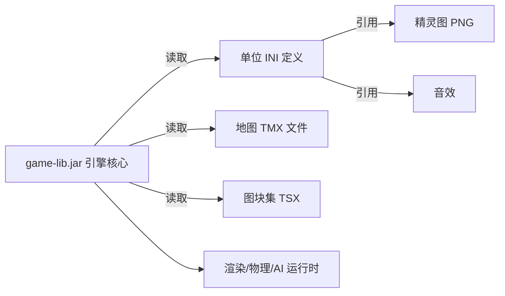
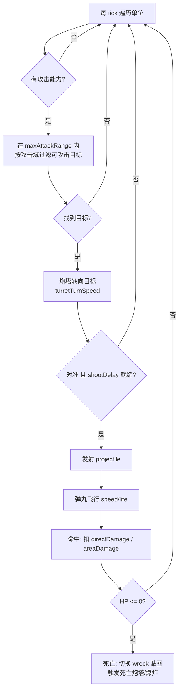

# RustedWarfare 实现分析文档

> 本文档分析参考项目 **Rusted Warfare（铁锈战争）** 的实现机制与设计理念，作为 GDUWS（Ghost Domains: Unmanned Warfare Sim）的开发参考。分析基于项目随附的资源文件（`assets/`）、库依赖（`libs/`）及配置文件，重点提炼可借鉴的单位系统、战斗系统、地图系统与 AI 行为机制。

---

## 一、项目总体架构

### 1.1 技术栈

通过 `libs/` 目录下的依赖库可以判断 RustedWarfare 的技术构成：

| 依赖 | 用途 |
| --- | --- |
| `lwjgl.jar` / `lwjgl_util.jar` / `lwjgl.dll` | LWJGL，底层 OpenGL/OpenAL/输入绑定 |
| `slick.jar` | Slick2D，2D 游戏渲染框架（基于 LWJGL） |
| `jogg` / `jorbis` / `ibxm.jar` | 音频解码（OGG / 音乐模块） |
| `jinput.jar` + `jinput-*.dll` | 手柄/输入设备 |
| `game-lib.jar` | 游戏主体逻辑（编译后的字节码，闭源） |
| `httpclient` / `steamworks4j` | 联网对战与 Steam 集成 |

**结论**：RustedWarfare 是一款基于 **Java + LWJGL + Slick2D** 的 2D 即时战略游戏。核心逻辑封装在 `game-lib.jar` 中，但**游戏内容（单位、地图、规则）几乎完全由外部数据文件驱动**，这正是其最值得 GDUWS 借鉴的设计。

### 1.2 数据驱动（Data-Driven）架构

RustedWarfare 最核心的设计思想是 **逻辑与数据分离**：



- 单位行为、属性、武器、动画全部写在纯文本 **INI 文件** 中（`assets/units/`）。
- 地图使用业界通用的 **Tiled（TMX/TSX）** 格式（`assets/maps/`、`assets/tilesets/`）。
- 美术素材为独立 **PNG**，由 INI 通过文件名引用。
- 引擎在运行时解析这些数据，无需重新编译即可新增单位 / 地图（即"Mod 系统"）。

> **对 GDUWS 的启示**：GDUWS 应同样采用数据驱动架构，将无人装备的属性（速度、攻击范围、可攻击域）外置为配置文件（如 JSON/INI），引擎只实现通用的"移动 / 侦察 / 打击 / 规避"逻辑，便于快速迭代关卡与单位平衡。

---

## 二、单位定义系统（核心）

每个单位是一个目录，包含一个或多个 `.ini` 定义文件与若干 PNG 贴图。INI 文件由若干 `[section]` 段落组成。下面以轻型坦克 `assets/units/tanks/tank.ini` 为主线，结合侦察单位、飞机、潜艇、炮塔进行分析。

### 2.1 段落总览

| 段落 | 作用 | GDUWS 对应 |
| --- | --- | --- |
| `[core]` | 基础元数据：名称、价格、血量、质量、半径、视野 | 单位基础属性 |
| `[graphics]` | 贴图、动画帧、阴影、缩放、移动特效 | 渲染表现 |
| `[attack]` | 攻击总开关、可攻击目标类型、射程、射击间隔 | **攻击域规则** |
| `[turret_n]` | 炮塔：位置、转速、绑定的弹药、射击音效/光效 | 武器挂载 |
| `[projectile_n]` | 弹药：伤害、速度、存活时间、范围伤害 | 弹道与伤害 |
| `[movement]` | 移动类型、速度、加减速、转向、目标高度 | **移动域规则** |
| `[action_*]` | 可执行动作（建造、升级、转换） | 升级/转换 |
| `[animation_*]` | 状态动画（idle、moving 等） | 动画状态机 |
| `[ai]` | AI 建造优先级与数量上限 | AI 决策权重 |
| `[effect_*]` | 自定义粒子特效 | 视觉特效 |

### 2.2 `[core]` —— 基础属性

```ini
[core]
name: c_tank
class: CustomUnitMetadata
price: 350
maxHp: 210
mass: 3000
radius: 11
techLevel: 1
```

关键字段：
- `name`：单位唯一标识符。
- `maxHp`：最大生命值（战斗结算核心）。
- `mass`：质量，影响碰撞推挤。
- `radius`：碰撞/选择半径。
- `fogOfWarSightRange`（见侦察单位）：**视野范围**，决定能探测多远的敌人——这是 GDUWS "侦察"机制的直接对应物。

侦察单位 `scout.ini` 额外定义：

```ini
fogOfWarSightRange: 22
fogOfWarSightRangeWhileNotBuilt: 15
```

> **借鉴点**：RustedWarfare 用 `fogOfWarSightRange` 与"战争迷雾"实现侦察。GDUWS 的侦察单位可拥有较大视野半径，打击单位视野较小，从而强制形成"侦察→共享情报→打击"的协同链路。

### 2.3 `[attack]` —— 攻击域规则（最关键）

RustedWarfare 用一组布尔开关精确定义"谁能打谁"，这与 GDUWS 概要设计中"轻坦不能打空、驱逐舰能打空和水下"等需求**高度吻合**：

```ini
[attack]
canAttack: true
canAttackFlyingUnits: false      ; 能否攻击空中单位
canAttackLandUnits:   true       ; 能否攻击地面单位
canAttackUnderwaterUnits: false  ; 能否攻击水下单位
maxAttackRange: 130              ; 最大攻击射程
shootDelay: 75                   ; 射击间隔（帧/tick）
```

各单位攻击域对照（来自实际 INI）：

| 单位 | 打空 | 打地/水面 | 打水下 | 说明 |
| --- | --- | --- | --- | --- |
| 轻型坦克 tank | ✗ | ✓ | ✗ | 对应 GDUWS 轻型坦克 |
| 侦察 scout | ✓ | ✓ | ✗ | 全能但弱（侦察兼自卫） |
| 拦截机 interceptor | ✓ | ✗ | ✗ | 对应 GDUWS 拦截机 |
| 轻型潜艇 lightSub | ✗ | ✓ (水面) | ✓ | 对应 GDUWS 潜艇/驱逐舰思路 |
| 防空炮塔 antiAir | ✓ | ✗ | ✗ | 纯对空 |

> **直接映射到 GDUWS**：
> - 轻型坦克：`canAttackLand=true`，其余 false。
> - 重型坦克：land + flying + (水面) true。
> - 战列舰：仅水面 true；驱逐舰：水面 + flying + underwater true；潜艇：仅 underwater(含水面舰) true。
> - 拦截机：仅 flying；攻击机：仅 land/water。
> 
> `lightSub.ini` 中的 `canAttackNotTouchingWaterUnits: false` 还能进一步区分"贴水面"与"完全水下"单位，可用于实现 GDUWS"只有驱逐舰和潜艇能打潜艇"的细则。

### 2.4 `[turret_n]` 与 `[projectile_n]` —— 武器与弹道

炮塔与弹药分离设计，一个单位可挂多个炮塔，炮塔引用弹药编号：

```ini
[turret_1]
x: 0
y: 0
projectile: 1            ; 引用 [projectile_1]
turretTurnSpeed: 4       ; 炮塔转速
shoot_sound: tank_firing
recoilOffset: -2         ; 后坐表现

[projectile_1]
directDamage: 25         ; 直接伤害
life: 60                 ; 弹丸存活时间
speed: 5                 ; 飞行速度
```

进阶特性（来自其它单位）：
- **从属炮塔** `slave: true` + `attachedTo: 1`（拦截机的 turret_2 绑定到 turret_1）。
- **追踪弹** 潜艇鱼雷 `targetSpeed` / `targetSpeedAcceleration` 实现加速追踪。
- **范围伤害** `areaDamage` / `areaRadius` / `areaExpandTime`（fabricator 死亡爆炸）。
- **直接命中** `instant: true`（瞬间命中，无弹道）。

> **借鉴点**：GDUWS 初期可简化为"直接伤害 + 固定射程"模型（参考坦克），追踪弹与范围伤害作为后期扩展。炮塔/弹药分离便于复用弹种。

### 2.5 `[movement]` —— 移动域规则

移动类型 `movementType` 决定单位可通行的地形，这是 GDUWS "陆/水/空/水下"分层的核心：

实际项目中出现的全部移动类型（grep 统计）：

| movementType | 含义 | GDUWS 对应 |
| --- | --- | --- |
| `LAND` | 仅平地（坦克、火炮、机甲小） | 地面单位 |
| `WATER` | 水面/水下（战舰、潜艇） | 水域单位 |
| `AIR` | 空中（飞机、直升机、导弹艇） | 空中单位 |
| `HOVER` | 悬浮，可过浅水（侦察、工程） | 可作侦察单位特性 |
| `OVER_CLIFF` | 可翻越悬崖（机甲） | （扩展） |
| `OVER_CLIFF_WATER` | 翻崖+过水（蜘蛛） | （扩展） |
| `NONE` | 固定不动（建筑、炮塔） | 防御工事 |

水下深度通过 `targetHeight` 表达：

```ini
; 拦截机（空中，高度 20）
targetHeight: 20
; 潜艇（水下，高度 -8）
targetHeight: -8
targetHeightDrift: 0.4
```

移动物理参数：

```ini
moveSpeed: 1.1                 ; 最大速度
moveAccelerationSpeed: 0.07    ; 加速度
moveDecelerationSpeed: 0.17    ; 减速度
maxTurnSpeed: 4.1              ; 最大转向速度
turnAcceleration: 0.25         ; 转向加速度
moveSlidingMode: false         ; 滑行模式（飞机/悬浮单位为 true）
moveIgnoringBody: false        ; 移动是否忽略机体朝向
```

> **借鉴点**：GDUWS 用一个枚举 `MovementType { LAND, WATER, AIR, UNDERWATER }` 即可覆盖概要设计的需求。空域"不占格子"的设定，正对应 RustedWarfare 中 AIR 单位用 `targetHeight` 飞在地形之上、不参与地面碰撞的做法。潜艇用负高度表示水下层，天然实现"只有特定单位能打到水下"。

### 2.6 继承与复用机制

RustedWarfare 提供两种代码复用方式，减少重复定义：

```ini
; 1) 从模板继承全部字段，再覆盖差异
copyFrom: turret_common_land.ini

; 2) 覆盖并替换内置单位（用 Mod 替换原版单位）
overrideAndReplace: tank
displayLocaleKey: tank
```

还存在 `all-units.template` 模板文件供批量套用。

> **借鉴点**：GDUWS 单位配置可设计"基类模板 + 差异覆盖"，例如所有坦克共享 `tank_base`，重坦只覆盖 `maxHp` 与攻击域。

### 2.7 动作与升级 `[action_*]`

```ini
[action_upgradeT2]
convertTo: fabricatorT2     ; 升级后变为哪个单位
price: 4400
buildSpeed: 65.6s
displayType: upgrade
```

炮塔可分支升级为机炮/火炮/火焰/闪电等（见 `turret_t1.ini` 的多个 `[action_upgrade_*]`）。GDUWS 初期不需要升级树，可忽略，但其"`convertTo` 单位替换"思路对实现"潜艇上浮/下潜状态切换"有参考价值（如 `amphibious_jet` 用 `_underwater`/`_transition`/`_landed` 多文件切换形态）。

---

## 三、战斗系统

### 3.1 战斗结算流程

基于 INI 字段可推断引擎的战斗循环：



关键结算要素：
- **目标选择**：射程内 + 攻击域匹配；引擎通常选最近目标（与 GDUWS"打击单位优先攻击最近敌人"一致）。
- **伤害模型**：`directDamage` 直接扣血；`areaDamage` 范围扣血；`deflectionPower` 影响偏转/护甲。
- **射速控制**：`shootDelay` 为冷却帧数。
- **死亡表现**：`image_wreak`（残骸贴图）、`fireTurretXAtSelfOnDeath`（死亡爆炸）。

### 3.2 命中与几何

弹丸具有 `speed` 与 `life`，即"飞行速度 × 存活时间 = 有效射程"，需与 `maxAttackRange` 协调。`drawSize`、`trailEffect`、`largeHitEffect` 为表现层。

> **对 GDUWS 的启示**：GDUWS 概要设计是"自动战斗、规则推演"，可采用与此一致的 **tick 驱动战斗循环**：每帧为每个单位执行"感知 → 决策 → 移动/攻击"。初期弹道可简化为"命中判定瞬时结算"，仅保留 `directDamage`、`maxAttackRange`、`shootDelay` 三个核心参数。

---

## 四、地图系统

### 4.1 Tiled（TMX/TSX）格式

地图为标准 Tiled XML（`assets/maps/skirmish/*.tmx`）：

```xml
<map version="1.0" orientation="orthogonal" renderorder="right-down"
     width="130" height="130" tilewidth="20" tileheight="20">
  <tileset firstgid="1" name="Mountain" tilewidth="20" tileheight="20"
           tilecount="35" columns="7">
    <image source="terrain/bitmaps/mountain.png" .../>
    <tile id="7"><properties><property name="small-rock" value=""/></properties></tile>
    ...
  </tileset>
</map>
```

要点：
- **正交网格**，单格 20×20 像素，地图如 130×130 格。
- 多个 **tileset（图块集）**，通过 `firstgid` 区分编号区间。
- 图块通过 **自定义属性**（`small-rock`、`large-rock`、`tree`）标记地形语义——这些属性决定**可通行性 / 遮挡**。
- 配套 `*_map.png` 为缩略小地图预览。

`assets/tilesets/` 下的 `.tsx` 文件（`terrain.tsx`、`decoration.tsx`、`units.tsx`）定义共享图块集与碰撞属性。

### 4.2 地形与可通行性

地形语义（山地/雪地/岩石/树木/水域/熔岩）通过图块属性表达，引擎据此构建各 `movementType` 的可通行矩阵：
- LAND 单位：平地可走，山地/岩石/水不可走（对应 GDUWS"可通行陆地/不可通行山地"）。
- WATER 单位：仅水域。
- AIR 单位：忽略地形。

> **借鉴点**：GDUWS 可直接采用 Tiled 编辑器制作关卡，或自定义更简单的二维网格（每格标 `LAND/WATER/MOUNTAIN`）。关键是为每种 `movementType` 预计算"可通行图层"，供寻路使用。

### 4.3 单位/出生点放置

TMX 通过 `objectgroup` 对象层放置出生点与初始单位（对象带 `gid` 引用 `units.tsx`）。GDUWS 的"玩家布兵阶段"可类比：玩家在可通行格子上放置己方单位，敌方单位由关卡数据预置。

---

## 五、AI 与行为逻辑

### 5.1 内置 AI 权重

单位 INI 的 `[ai]` 段提供 AI 建造决策权重（主要用于电脑玩家造兵造建筑）：

```ini
[ai]
buildPriority: 0.22          ; 建造优先级
maxEachBase: 3               ; 每个基地最多数量
maxGlobal: 5                 ; 全局最多数量
noneInBaseExtraPriority: 0.04 ; 基地缺该单位时的额外权重
```

这是一个**基于优先级权重的效用 AI**：电脑根据资源、缺口、上限决定下一个该造什么。

### 5.2 与 GDUWS 行为逻辑的对应

GDUWS 概要设计要求的"侦察 / 打击"行为，RustedWarfare 引擎本身用更通用的指令系统（移动、攻击、巡逻、警戒）实现，但其**视野（fogOfWar）+ 攻击域 + 移动域**三大数据基础完全可支撑 GDUWS 的自治行为：

| GDUWS 行为需求 | 可复用的 RustedWarfare 机制 |
| --- | --- |
| 侦察单位探索地图、发现敌人 | `fogOfWarSightRange` 视野 + 寻路移动 |
| 侦察单位避战、保持距离 | 自定义"远离最近敌人"的路径代价（引擎层新增） |
| 打击单位待命，发现后前往攻击 | 共享视野情报 + 移动到目标 + `[attack]` 结算 |
| 优先攻击最近敌人 | 引擎默认最近目标选择 |
| 兵力悬殊时撤退 | 比较周边友/敌数量后切换"撤退"状态（GDUWS 自定义状态机） |

> **结论**：RustedWarfare 提供了"单位属性 + 攻击域 + 移动域 + 视野"的完整数据底座，但 GDUWS 所需的**自主侦察/协同打击/战术规避**属于更高层的"群体行为决策"，需要 GDUWS 自行实现一个**有限状态机（FSM）或行为树**驱动每个无人单位。这是 GDUWS 相对 RustedWarfare 的差异化重点。

---

## 六、对 GDUWS 的可借鉴清单与差异

### 6.1 直接借鉴

1. **数据驱动架构**：单位/地图外置为配置文件，引擎只跑通用逻辑。
2. **攻击域三开关**：`canAttackFlying/Land/Underwater` 精确表达 GDUWS 的克制关系。
3. **移动类型枚举**：`LAND/WATER/AIR/UNDERWATER` 映射四维战场；空中用"高度"层叠在地形之上、不占格子。
4. **视野/迷雾机制**：`fogOfWarSightRange` 实现侦察与情报共享。
5. **tick 驱动战斗循环**：感知→决策→移动/攻击→结算→判定胜负。
6. **Tiled 网格地图**：用图块属性标记可通行性，按移动类型预计算通行图层。
7. **炮塔/弹药分离**与**继承复用（copyFrom）**：便于扩展与平衡调参。
8. **美术素材**：按 `skill.md` 说明，可直接复用 `assets/units/` 下的 PNG（坦克、飞机、战舰、潜艇等贴图齐全）。

### 6.2 GDUWS 需自行实现（RustedWarfare 未直接提供）

1. **自主群体 AI**：侦察的避战路径、打击的待命/进攻/撤退状态机、协同情报共享——这是 GDUWS 核心创新点。
2. **布兵阶段**：玩家先布置兵力再点击开始，之后全自动（RustedWarfare 是全程实时操控）。
3. **胜负判定**：一方损失 90% 即结束（需自定义统计）。
4. **简化经济**：GDUWS 初期无需 RustedWarfare 的资源采集/建造体系（`generation_resources`、`fabricator` 等可省略）。

### 6.3 建议的最小可行模型（MVP）参数集

GDUWS demo 阶段每个单位只需保留以下字段即可复刻 RustedWarfare 的核心手感：

```
core:      name, maxHp, radius, sightRange
movement:  movementType(LAND/WATER/AIR/UNDERWATER), moveSpeed
attack:    canAttackLand, canAttackWater, canAttackAir, canAttackUnderwater,
           maxAttackRange, directDamage, shootDelay
role:      SCOUT | STRIKE   (GDUWS 新增：决定行为状态机)
```

---

## 七、单位资源映射表（GDUWS ↔ RustedWarfare 素材）

| GDUWS 单位 | 可复用 RustedWarfare 素材目录 | 攻击域配置 |
| --- | --- | --- |
| 轻型坦克 | `units/tanks/tank.png` | land |
| 重型坦克 | `units/mammoth_tank/`、`units/tanks/heavy_artillery` | land + air + water |
| 战列舰 | `units/heavy_battleship/` | water(面) |
| 驱逐舰 | `units/heavy_aa_ship/`、`units/heavy_missile_ship/` | water + air + underwater |
| 潜艇 | `units/light_sub/`、`units/heavy_sub/` | underwater |
| 拦截机 | `units/interceptor/`、`units/heavy_interceptor/` | air |
| 攻击机 | `units/bomber/`、`units/light_gunship/` | land + water |
| 侦察单位 | `units/scout/`、`units/spy_drone/` | 弱自卫，大视野 |

---

## 八、总结

RustedWarfare 是一个**高度数据驱动**的 2D RTS：引擎（`game-lib.jar`）实现通用的渲染、物理、寻路、战斗与建造，而所有游戏内容由 **INI 单位定义 + TMX 地图**外部数据描述。其 **攻击域三开关、移动类型分层、视野迷雾、炮塔/弹药分离、Tiled 地图** 等机制与 GDUWS 的需求高度契合，可直接借鉴并复用美术素材。

GDUWS 与之的本质差异在于：RustedWarfare 强调"玩家实时操控 + 资源建造"，而 GDUWS 强调"先布兵、后自动推演"，核心价值在于**无人装备的自主侦察、协同打击与战术规避的群体 AI**。因此 GDUWS 应当：

1. 复用 RustedWarfare 的**数据驱动单位/地图建模思路**与**攻击/移动域规则**；
2. 自研一套**基于状态机/行为树的群体自治 AI**作为核心；
3. 砍掉资源建造体系，新增**布兵阶段**与**90% 损失胜负判定**。

下一步（对应 `todo.md` 第 2 项）将基于本分析与现有概要/需求文档，撰写 GDUWS 的详细设计说明书。
