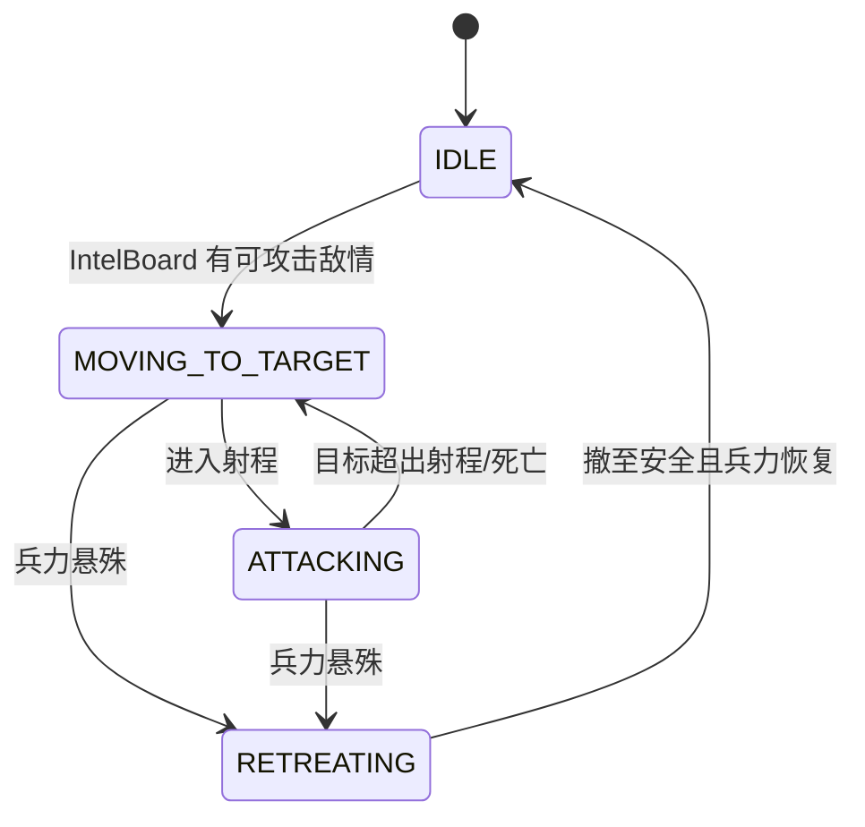

# GDUWS 分步实现指导说明

> 项目：**Ghost Domains: Unmanned Warfare Sim（GDUWS）** —— 2D 无人装备战争模拟游戏
>
> 本文档对应 `todo.md` 第 3 项，依据 [详细设计说明书.md](详细设计说明书.md) 将开发工作拆解为**可独立验证、循序渐进**的实现步骤，作为 demo 编码（`todo.md` 第 4 项）的直接施工手册。
>
> 每一步均给出：**目标、产出文件、关键实现要点、完成判据（验收标准）**，确保可按图施工、逐步可运行。

---

## 一、总体实现路线

采用 **"垂直切片 + 自底向上"** 策略：先打通"数据→模型→渲染→交互"的最小可运行链路，再逐层叠加移动、视野、AI、战斗，最后调参与美化。每一步都保证项目可编译、可运行、可观察到阶段性效果。


### 里程碑划分

| 里程碑 | 包含步骤 | 可演示效果 |
| --- | --- | --- |
| **M1 可见的静态战场** | Step0–Step3 | 选关、加载地图、玩家可在合法格放置单位 |
| **M2 会动的单位** | Step4–Step5 | 单位按寻路移动，侦察单位能"看见"并上报敌情 |
| **M3 自动对抗闭环** | Step6–Step8 | 点击开始后侦察→打击→撤退全自动推演，触发胜负 |
| **M4 完成 demo** | Step9 | 接入 RustedWarfare 美术素材，单位数值平衡 |

---

## 二、Step 0：工程骨架搭建

### 目标
建立可编译运行的 Java 工程与目录结构，确定包划分，跑通一个空窗口。

### 产出
```
GDUWS/
├── code/
│   ├── src/main/java/com/gduws/
│   │   ├── Main.java                  # 程序入口
│   │   ├── model/                     # 模拟层(无渲染依赖)
│   │   ├── control/                   # 主循环/状态机
│   │   ├── view/                      # 渲染/界面/输入
│   │   └── data/                      # 配置加载
│   ├── data/                          # 运行时数据(units/levels/maps)
│   │   ├── units/
│   │   ├── levels/
│   │   └── maps/
│   └── assets/                        # 复用的 PNG 素材
└── pom.xml (或不使用 Maven, 用 javac/脚本)
```

### 实现要点
1. 语言 **Java 17**（沿用参考项目 `jvm64`），渲染 **Swing/Java2D**，配置 **JSON**（引入 `org.json` 或 Jackson）。
2. 包结构严格遵循详细设计"逻辑与渲染分离"：`model` 包**禁止** import 任何 `java.awt`/`javax.swing`。
3. `Main.java` 创建一个 `JFrame` + 空 `JPanel`，能弹出窗口即可。
4. 若用 Maven，配置 `maven-shade-plugin` 打可运行 jar；若不用，写一个 `build.bat`/`run.bat`（可参考 RustedWarfare 的 `fallback.bat`）。

### 完成判据
- `javac` / `mvn package` 无错误。
- 运行后弹出标题为 "GDUWS" 的窗口。

---

## 三、Step 1：数据层与配置加载

### 目标
实现核心枚举、`UnitDef`、`AttackProfile` 等数据结构，并能从 JSON 加载单位与关卡定义。

### 产出
- `model/MovementType.java`、`UnitRole.java`、`Faction.java`、`TerrainType.java`、`UnitState.java`、`UnitLayer.java`
- `model/AttackProfile.java`、`model/UnitDef.java`
- `data/UnitDefLoader.java`、`data/LevelLoader.java`、`data/LevelDef.java`
- 至少 2 个单位配置：`data/units/light_tank.json`、`data/units/destroyer.json`
- 1 个关卡配置：`data/levels/level_01.json`

### 实现要点
1. 枚举严格按详细设计 4.1 定义。`UnitLayer` 由 `MovementType` 推导（LAND/WATER_SURFACE/AIR/UNDERWATER），供 `AttackProfile.canTarget()` 使用。
2. `UnitDef` 全程只读、可共享（享元模式）：一个 JSON ↔ 一个 `UnitDef` 实例 ↔ 多个 `Unit` 运行时引用。
3. `AttackProfile.canTarget(Unit target)` 是攻击克制的核心：按 `target.layer()` 查对应布尔位。
4. JSON 字段命名与详细设计第六节保持一致，避免后续返工。
5. 编写一个小的 `main` 或单元测试：加载所有 JSON 并打印，验证字段无误。

### 完成判据
- 运行加载程序，控制台正确打印每个单位的 `id/maxHp/movementType/attack` 字段。
- 验证 `destroyer` 的 `canAttackUnderwater=true`、`light_tank` 的 `canAttackUnderwater=false`。

> ⚠️ 本步是后续一切的基础，务必保证 JSON schema 与 `UnitDef` 字段**一一对应**。

---

## 四、Step 2：地图加载与渲染

### 目标
实现网格地图数据结构与字符地图解析，并用 Swing 把地形画出来。

### 产出
- `model/Tile.java`、`model/GameMap.java`
- `data/MapLoader.java`
- `data/maps/level_01.map`（字符网格：`.`=平地, `#`=山地, `~`=水域）
- `view/GameRenderer.java`（先只画地形）

### 实现要点
1. `GameMap` 持有 `Tile[][]`，`tileSize=20`（与参考项目一致）。
2. 实现坐标换算 `toCol(px)/toRow(py)` 与 `isPassable(cx, cy, mt)`：
   - LAND：仅 PLAIN 可通行；
   - WATER/UNDERWATER：仅 WATER 可通行；
   - AIR：恒为 true（空域不占格子）。
3. `MapLoader` 解析首行 `cols rows tileSize`，其后逐行读字符。
4. `GameRenderer` 按 `TerrainType` 着色：平地绿、山地灰、水域蓝。坐标系左上为原点。

### 完成判据
- 窗口中正确渲染出 `level_01.map` 的地形网格。
- 改动 `.map` 文件内容，重启后渲染随之变化。

---

## 五、Step 3：布兵阶段交互

### 目标
实现 `DEPLOY` 状态：加载敌方预置单位，玩家在合法格放置己方单位，点击"开始"切换战斗。

### 产出
- `model/Unit.java`（运行时单位，先只需坐标/朝向/hp/def/faction）
- `model/World.java`（持有 map + units，先只做容器）
- `control/GameStateManager.java`、`control/GameState.java`（枚举：LEVEL_SELECT/DEPLOY/BATTLE/RESULT）
- `view/DeployController.java`、`view/InputHandler.java`
- 渲染单位（先用色块/圆形占位）

### 实现要点
1. 进入 `DEPLOY` 时由 `LevelDef` 预置敌方单位到 `World`。
2. 玩家从可用单位面板选类型 → 点击地图格放置，校验：
   - 目标格对该单位 `movementType` 可通行；
   - 不与已有单位重叠；
   - 数量不超过关卡给定上限。
3. 提供"开始战斗"按钮 → `GameStateManager` 切到 `BATTLE`（此步先只切状态，不做推演）。
4. 渲染按 `Faction` 用不同颜色区分敌我。

### 完成判据（**里程碑 M1 达成**）
- 选关后进入布兵，能放置/移除己方单位，非法放置被拒绝。
- 敌方单位按关卡预置显示。
- 点击开始后界面进入战斗态（单位静止）。

---

## 六、Step 4：移动与寻路

### 目标
实现 A* 寻路与"沿路径移动"，让单位能从 A 走到 B。

### 产出
- `model/Pathfinder.java`（A*）
- `model/MovementSystem.java`（沿 `path` 推进 + 朝向插值）
- `control/GameLoop.java`（固定步长 30 tick/s 逻辑帧）
- `World.tick()` 雏形（先只调用移动系统）

### 实现要点
1. `Pathfinder.findPath(unit, goal, avoidEnemies)`：8 邻接，Octile 启发式，`movementType` 决定可通行格，开放表用二叉堆。
2. `avoidEnemies=true` 时 g 值叠加 `threatCost`（为 Step6 侦察避战预留，本步可先传 false）。
3. `MovementSystem` 每 tick：取 `path` 队首格，朝其移动 `moveSpeed`，到达后出队；同步更新 `facing`。
4. `GameLoop` 用固定步长累加器，逻辑帧与渲染帧解耦。
5. 临时测试：布兵后点击地图给某单位下移动指令，观察其寻路绕开山地/水域。

### 完成判据
- 单位能沿合法路径移动到目标，自动绕开不可通行地形。
- LAND 单位不会走进水域，WATER 单位不会上岸，AIR 单位走直线。

---

## 七、Step 5：视野与情报系统

### 目标
实现 `VisionSystem` 与 `IntelBoard`，打通"侦察→共享情报"链路。

### 产出
- `model/VisionSystem.java`
- `model/IntelBoard.java`（每阵营一个）
- `World.tick()` 中加入视野更新阶段
- 渲染：可选地显示视野圈与已知敌情标记

### 实现要点
1. 每 tick 计算每个单位 `sightRange` 半径内的敌方单位。
2. 发现的敌人写入**本阵营** `IntelBoard`：记录目标引用、最近位置、时间戳。
3. `IntelBoard.hasAnyEnemy()`、`getKnownEnemies()` 供 AI 查询。
4. 关键设计：**打击单位不依赖自身视野，而查询本阵营 IntelBoard** —— 这是"侦察发现后打击才行动"的技术基础。
5. 可加可视化：渲染己方视野范围、用问号/方框标记 IntelBoard 中的敌情位置，便于调试。

### 完成判据（**里程碑 M2 达成**）
- 侦察单位移动靠近敌人时，敌情出现在 IntelBoard（渲染可见标记）。
- 敌人离开视野后，IntelBoard 仍保留最后已知位置（带时间戳）。

---

## 八、Step 6：群体 AI 状态机（核心）

### 目标
实现侦察与打击两类单位的有限状态机（FSM），这是 GDUWS 的差异化核心。

### 产出
- `model/AISystem.java`
- `model/ai/ScoutAI.java`（侦察 FSM）
- `model/ai/StrikeAI.java`（打击 FSM）
- `World.tick()` 中加入 AI 决策阶段（位于视野更新之后、移动之前）

### 实现要点

**侦察 FSM（`SCOUTING` 持续到游戏结束）：**
1. 选探索目标：地图按区块记录"最后探索时间"，选最旧区块前往。
2. **避战**：调用 `findPath(..., avoidEnemies=true)`，威胁场使路径绕开已知敌人。
3. 每 tick 上报视野内敌人到 IntelBoard。

**打击 FSM：**

1. 开局 `IDLE`，等 `IntelBoard.hasAnyEnemy()`。
2. 选**最近的、本单位攻击域可命中**的已知敌人（`attack.canTarget()` 过滤）。
3. 进入射程转 `ATTACKING`（攻击结算在 Step7）。
4. **撤退判定**：半径 R 内比较友/敌兵力，若 `friendlyPower < enemyPower * RETREAT_RATIO`（如 0.5），转 `RETREATING`，向远离敌人质心方向撤离。

### 完成判据
- 侦察单位持续探索且主动绕开敌人。
- 打击单位开局静止，IntelBoard 有敌情后才出动，移动到敌人附近。
- 构造兵力悬殊场景，验证打击单位会撤退。

---

## 九、Step 7：战斗系统与胜负判定

### 目标
实现命中瞬时结算的战斗，以及"一方损失 90% 即结束"的胜负判定。

### 产出
- `model/CombatSystem.java`
- `World.checkVictory()`
- `World.tick()` 中加入战斗结算与胜负判定阶段
- 渲染：血条、攻击连线/弹道特效

### 实现要点
1. `CombatSystem.update()`：遍历有攻击能力的单位 →
   - `shootCooldown` 递减；
   - 在 `maxAttackRange` 内、用 `attack.canTarget()` 过滤、选最近目标；
   - 对准且冷却就绪 → 扣 `directDamage`，重置 `shootCooldown=shootDelay`。
2. MVP **命中瞬时结算**（无飞行弹道），`Projectile`/`areaDamage` 作为扩展点预留接口。
3. 死亡处理：`hp<=0` → 状态置 `DEAD`，从 `World` 移除（或标记后统一清理），从对方 IntelBoard 清除。
4. `checkVictory()`：统计各阵营存活比，某方损失 ≥90% → 切 `RESULT`，幸存单位停止行动。

### 完成判据
- 单位进入射程后互相扣血，HP 归零死亡并消失。
- "只有驱逐舰/潜艇能打潜艇"等克制规则生效（轻坦无法击中空中/水下单位）。
- 一方损失 90% 时战斗结束。

---

## 十、Step 8：状态机串联全流程

### 目标
将 选关→布兵→战斗→结算 四态完整串联，形成可重玩闭环。

### 产出
- `view/LevelSelectScreen.java`、`DeployScreen.java`、`BattleScreen.java`、`ResultScreen.java`
- `control/GameStateManager` 完整状态转移
- 战斗中双方剩余兵力计数显示（只读）

### 实现要点
1. `LEVEL_SELECT`：列出关卡，选中加载 `LevelDef` → `DEPLOY`。
2. `DEPLOY`：布兵（复用 Step3）→ 开始 → `BATTLE`。
3. `BATTLE`：关闭交互，`World.tick()` 自动推演（整合 Step4–7）→ 胜负触发 `RESULT`。
4. `RESULT`：显示胜/负与统计，提供"下一关 / 重新挑战 / 退出"。
5. 重新挑战需正确重置 `World`/`IntelBoard`/单位状态，避免脏数据。

### 完成判据（**里程碑 M3 达成**）
- 从选关到结算可完整走通一局，无需重启程序即可重玩。
- 战斗全程自动，玩家仅观战。

---

## 十一、Step 9：素材接入与数值调参

### 目标
接入 RustedWarfare 美术素材，补齐七种单位，平衡数值。

### 产出
- 从 `RustedWarfare/assets/units/` 复制 PNG 到 `code/assets/`（按分析文档第七节映射表）
- 补齐全部单位 JSON：轻型坦克、重型坦克、战列舰、驱逐舰、潜艇、拦截机、攻击机、侦察单位
- `view/SpriteCache.java`（加载/缓存 PNG，按 `facing` 旋转绘制）
- 调参后的关卡配置

### 实现要点
1. 素材映射（分析文档第七节）：
   | GDUWS 单位 | 复用素材 |
   | --- | --- |
   | 轻型坦克 | `units/tanks/tank.png` |
   | 重型坦克 | `units/mammoth_tank/` |
   | 战列舰 | `units/heavy_battleship/` |
   | 驱逐舰 | `units/heavy_aa_ship/` |
   | 潜艇 | `units/light_sub/` |
   | 拦截机 | `units/interceptor/` |
   | 攻击机 | `units/bomber/` |
   | 侦察单位 | `units/scout/` |
2. 空中单位绘制阴影并叠加在地表之上（体现高度层）。
3. 数值平衡：参照详细设计 4.2 攻击域对照表，调 `maxHp/moveSpeed/maxAttackRange/directDamage/shootDelay/sightRange`，确保侦察视野最大、克制关系明显。

### 完成判据（**里程碑 M4 / demo 完成**）
- 七种单位均有素材并按朝向正确渲染。
- 一局对抗能直观看到侦察、协同打击、撤退三种行为。
- 单位克制平衡合理，战斗有来有回。

---

## 十二、实现顺序与依赖关系总表

| Step | 主要产出 | 依赖 | 可独立验证 |
| --- | --- | --- | --- |
| 0 工程骨架 | 包结构、空窗口 | — | ✓ 弹窗口 |
| 1 数据层 | 枚举/UnitDef/加载器 | 0 | ✓ 打印配置 |
| 2 地图渲染 | GameMap/MapLoader/渲染 | 1 | ✓ 画地形 |
| 3 布兵交互 | World/状态机/放置 | 2 | ✓ M1 |
| 4 移动寻路 | A*/MovementSystem/GameLoop | 3 | ✓ 单位移动 |
| 5 视野情报 | VisionSystem/IntelBoard | 4 | ✓ M2 |
| 6 群体AI | AISystem/Scout/Strike FSM | 5 | ✓ 行为正确 |
| 7 战斗胜负 | CombatSystem/checkVictory | 6 | ✓ 对战结算 |
| 8 全流程 | 四态界面串联 | 7 | ✓ M3 |
| 9 素材调参 | PNG/七单位/平衡 | 8 | ✓ M4 demo |

---

## 十三、开发与调试建议

1. **每步提交一次 Git**（项目已 `git init`），commit message 标注 Step 编号，便于回滚。
2. **model 层先行可测**：因 model 不依赖渲染，可写无界面的 `main` 跑 N tick 验证 AI/战斗逻辑，加速调试。
3. **可视化调试开关**：用快捷键切换显示 视野圈 / IntelBoard 标记 / 寻路路径 / 攻击连线，定位行为异常。
4. **固定随机种子**：AI 决策若用随机（如探索区块选择），固定种子保证"规则推演"可复现。
5. **先占位后美化**：Step2–8 用色块/圆形占位，Step9 才接素材，避免早期被渲染细节拖慢逻辑开发。
6. **数据与代码分离**：调平衡只改 JSON，不改代码，体现数据驱动优势。

---

## 附：建议的最终目录结构

```
GDUWS/
├── docs/                       # 文档(本文件所在)
└── code/
    ├── src/main/java/com/gduws/
    │   ├── Main.java
    │   ├── model/
    │   │   ├── MovementType.java  UnitRole.java  Faction.java
    │   │   ├── TerrainType.java   UnitState.java UnitLayer.java
    │   │   ├── AttackProfile.java UnitDef.java   Unit.java
    │   │   ├── Tile.java          GameMap.java   World.java
    │   │   ├── Pathfinder.java    MovementSystem.java
    │   │   ├── VisionSystem.java  IntelBoard.java
    │   │   ├── CombatSystem.java
    │   │   └── ai/  ScoutAI.java  StrikeAI.java  AISystem.java
    │   ├── control/  GameLoop.java  GameStateManager.java  GameState.java
    │   ├── view/     GameRenderer.java InputHandler.java SpriteCache.java
    │   │             LevelSelectScreen.java DeployScreen.java
    │   │             BattleScreen.java ResultScreen.java DeployController.java
    │   └── data/     UnitDefLoader.java LevelLoader.java LevelDef.java
    │                 MapLoader.java
    ├── data/
    │   ├── units/    light_tank.json heavy_tank.json battleship.json
    │   │             destroyer.json submarine.json interceptor.json
    │   │             bomber.json scout.json
    │   ├── levels/   level_01.json ...
    │   └── maps/     level_01.map ...
    └── assets/       (从 RustedWarfare 复用的 PNG)
```
