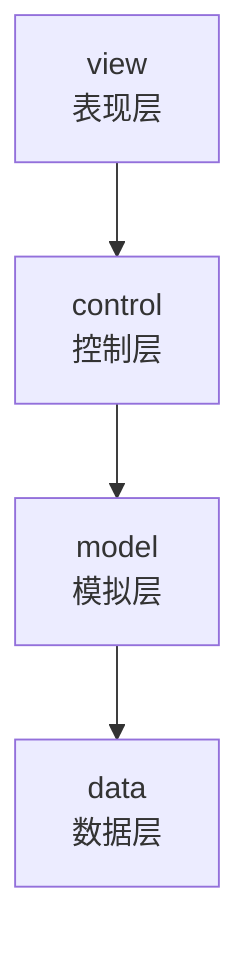
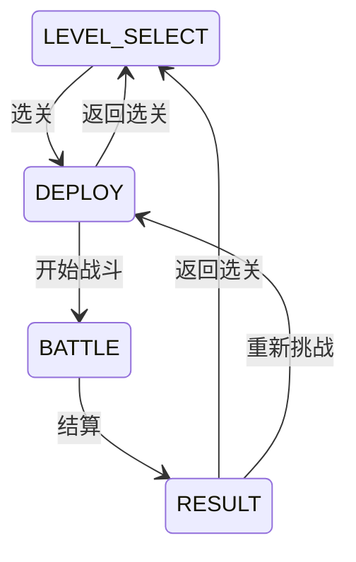
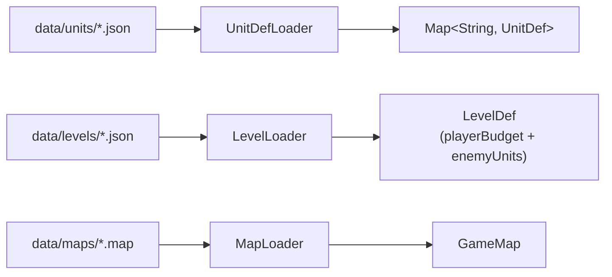
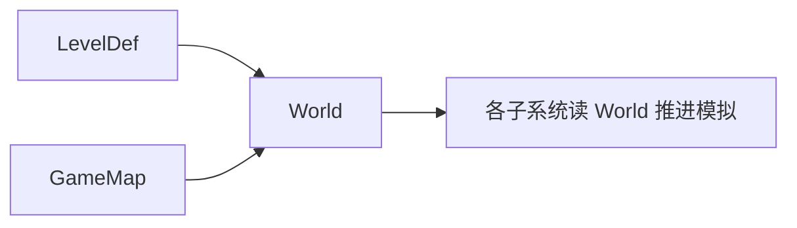
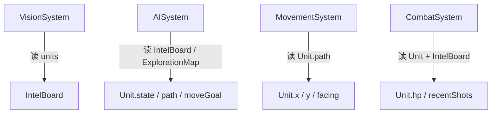
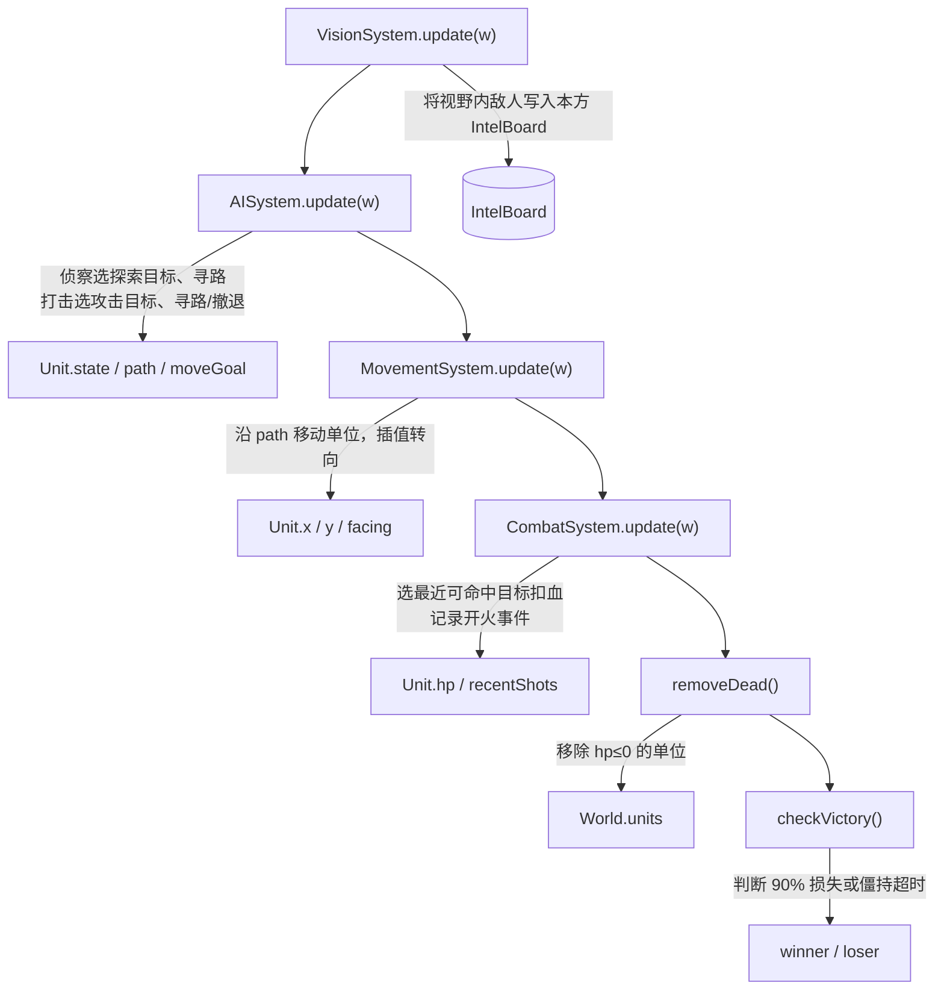
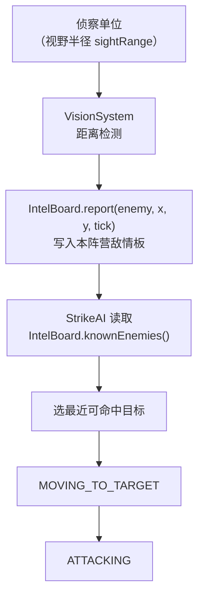
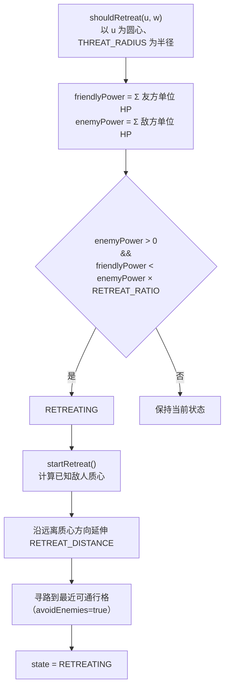

# 概要设计说明书

## 一、引言

### 1.1 编写目的

本文档基于《需求分析说明书》，给出 GDUWS 的系统架构、模块划分、技术选型、数据设计和关键算法思路，作为后续编码实现和详细设计的依据。

### 1.2 参考文档

- 《需求分析说明书》
- 《RustedWarfare 分析文档》

### 1.3 设计目标与原则

1. **逻辑与渲染分离**：模拟层（model）不依赖 AWT/Swing，可独立做规则推演。
2. **数据驱动**：单位属性、关卡、地图外置为配置文件，引擎只实现通用逻辑。
3. **tick 驱动**：以固定步长（30 tick/s）的逻辑帧推进战斗，保证可复现的规则推演。
4. **MVP 优先**：先跑通选关→布兵→战斗→结算的完整闭环，扩展特性留接口。

---

## 二、技术选型

| 项 | 选型 | 理由 |
|---|---|---|
| 语言 | Java 17+ | Swing 生态成熟；参考项目 RustedWarfare 同为 Java，便于复用素材 |
| 渲染 | Java2D / Swing（`JPanel` + `Graphics2D`） | demo 阶段轻量够用；后期可替换为 libGDX，model 层无需改动 |
| 配置格式 | JSON | 可读性好，手写解析器无第三方依赖 |
| 构建 | PowerShell + `javac` + `jlink` | 无 Maven，简化环境搭建；`jlink` 生成最小 JRE，`csc` 编译原生 exe 启动器 |
| 素材 | 复用 RustedWarfare 的 PNG 图块与单位精灵 | 加快开发，避免从零制作美术资源 |
| 音频 | JOrbis（`jorbis`/`jogg`）解码 OGG | 纯 Java 实现，无原生库依赖 |

---

## 三、系统总体架构

### 3.1 分层架构



| 层 | 职责 | 关键类 |
|---|---|---|
| **view** | Swing 窗口、画布渲染、鼠标输入、启动 | `GameFrame`, `GamePanel`, `GameRenderer`, `InputHandler` |
| **control** | 状态机、主循环、布兵逻辑 | `GameStateManager`, `GameLoop`, `DeployController` |
| **model** | 战场世界、单位、各子系统（不依赖 AWT/Swing） | `World`, `Unit`, `GameMap`, 各 `*System` |
| **data** | JSON 解析、配置文件加载 | `Json`, `UnitDefLoader`, `LevelLoader`, `MapLoader` |

### 3.2 游戏总状态机



| 状态 | 行为 |
|---|---|
| `LEVEL_SELECT` | 列出关卡，玩家选择 |
| `DEPLOY` | 加载地图和敌方预置；玩家放置己方单位；禁布区蒙版可见 |
| `BATTLE` | 禁用玩家操控，`World.tick()` 以 30 tick/s 自动推演 |
| `RESULT` | 显示胜负与兵力统计；可重新挑战或返回选关 |

---

## 四、模块划分

### 4.1 模拟层（model）

| 模块 | 职责 | 对外接口 | 依赖 |
|---|---|---|---|
| `World` | 持有地图和全部单位，每 tick 按序推进各子系统；提供单位查找、阵营计数 | `tick()`, `addUnit()`, `removeUnit()`, `unitAt()`, `intelOf(faction)`, `countAlive(faction)` | GameMap, Unit, 全部子系统 |
| `GameMap` | 网格地图：地形、可通行性判断、像素/格坐标换算 | `isPassable(cx,cy,mt)`, `isDeployable()`, `cellCenterX/Y()`, `toCol/Row()` | Tile, TerrainType |
| `Unit` / `UnitDef` | 单位运行时状态（位置/HP/朝向/路径/AI状态）+ 静态属性定义（享元共享） | `UnitDef`: 只读属性；`Unit`: 全部字段公开 | AttackProfile, MovementType |
| `VisionSystem` | 每 tick 计算各单位视野范围内的敌方，写入 IntelBoard | `update(World)` | IntelBoard |
| `IntelBoard` | 单阵营已知敌情表：存储敌人引用、最近位置和时间戳 | `report(enemy,x,y,tick)`, `knownEnemies()`, `forget(enemy)` | — |
| `AISystem` | 按角色分派 ScoutAI / StrikeAI；闲置打击超时转侦察 | `update(World)` | ScoutAI, StrikeAI |
| `ScoutAI` | 侦察 FSM：选最旧未探索区域 → 避战寻路 → 机会主义出击 | `update(Unit, World)` | ExplorationMap, Pathfinder, IntelBoard |
| `StrikeAI` | 打击 FSM：IDLE → MOVING_TO_TARGET → ATTACKING；敌强我弱时 RETREATING | `update(Unit, World)` | Pathfinder, IntelBoard |
| `MovementSystem` | 沿 path 队列按步长推进单位，插值旋转朝向 | `update(World)` | — |
| `CombatSystem` | 选射程内最近的可命中目标，冷却就绪时瞬时扣血；记录 ShotEvent 供渲染 | `update(World)` | AttackProfile |
| `Pathfinder` | A* 网格寻路（8 邻接 + Octile 启发式）；可选威胁场避让 | `findPath(mt, start, goal, avoidEnemies, intel)` | GameMap, IntelBoard |
| `ExplorationMap` | 将地图划分为 REGION_SIZE×REGION_SIZE 区块，按阵营记录每块最后访问 tick；为侦察选目标 | `markVisited(faction,x,y,tick)`, `pickGoal(faction,cx,cy,mt)` | GameMap |

### 4.2 控制层（control）

| 模块 | 职责 | 对外接口 | 依赖 |
|---|---|---|---|
| `GameStateManager` | 管理选关→布兵→战斗→结算的状态切换 | `getState()`, `setState(s)`, `is(s)` | — |
| `GameLoop` | 用 `javax.swing.Timer` 以 30 tick/s 推进 World；仅在 BATTLE 态推进；检测胜负停止 | `start()`, `stop()`, `setOnVictory(callback)` | World, GameStateManager |
| `DeployController` | 布兵逻辑：管理配额、校验放置合法性、切换选中单位类型和角色 | `tryPlace(px,py)`, `tryRemove(px,py)`, `toggleRoleAt(px,py)`, `remaining()` | World, UnitDefLoader |
| `BattleSetup` | 把关卡定义中的敌方预置单位实例化并放入 World | `placeEnemies(world, level)` | World, UnitDefLoader |

### 4.3 表现层（view）

| 模块 | 职责 | 对外接口 | 依赖 |
|---|---|---|---|
| `GameFrame` | 主窗口：串联全流程，构建侧栏（CardLayout）和战场画布，响应状态切换 | — | 所有 control/model 模块 |
| `GamePanel` | 战场画布：缩放（滚轮）、平移（右键拖拽）、框选、坐标换算 | `worldX/Y(screenX/Y)`, `beginSelection/updateSelection/endSelection()` | World, GameRenderer |
| `GameRenderer` | 纯绘制：地形→装饰→禁布区蒙版→网格→视野→路径→攻击线→单位→血条→已知敌情 | `render(Graphics2D, World)` | World（只读） |
| `InputHandler` | 鼠标事件分发：布兵阶段放置/移除/切换；战斗阶段单击选中/框选 | — | DeployController, GameStateManager, GamePanel |
| `StartupDialog` | 模态弹窗选择全屏或窗口分辨率 | `choose()` → `Config` | — |

### 4.4 数据层（data）

| 模块 | 职责 | 对外接口 | 依赖 |
|---|---|---|---|
| `Json` | 手写递归下降 JSON 解析器（对象→`Map`，数组→`List`，数字→`Double`） | `parse(text)`, `parseObject(text)` | — |
| `UnitDefLoader` | 从 `data/units/*.json` 加载全部 UnitDef，按 id 索引 | `get(id)`, `all()` | Json |
| `LevelLoader` | 从 JSON 加载 LevelDef（含 playerBudget 和 enemyUnits） | `loadFile(path)` | Json |
| `MapLoader` | 解析分层 `.map` 文本文件，构建 GameMap | `loadFile(path)` | GameMap, Tile |

### 4.5 音频（audio）

| 模块 | 职责 | 对外接口 | 依赖 |
|---|---|---|---|
| `MusicPlayer` | 后台线程循环播放 OGG：按 Scene 分曲池，切换场景立即换曲；解码失败静默降级 | `start()`, `setScene(Scene)`, `shutdown()` | JOrbis（第三方 JAR） |

---

## 五、数据设计

### 5.1 运行时数据流

**配置加载：**



**选关时：**



**Tick 内数据流：**



### 5.2 核心数据结构设计

**UnitDef（享元）**：单位类型的静态属性。由 JSON 加载，被同类型的所有 Unit 实例共享。包含 `id`、`displayName`、`maxHp`、`radius`、`movementType`、`moveSpeed`、`sightRange`、`attack`（AttackProfile）、`spritePath`。

**Unit（运行时）**：每个战场上的单位实例。持有 `def`（指向 UnitDef）、`faction`、`x/y`（像素坐标）、`hp`、`facing`（弧度）、`role`（SCOUT/STRIKE，运行时可变）、`state`（AI 状态）、`path`（`Deque<Point>` 格序列）、`currentTarget`。

**GameMap / Tile**：网格地图。`Tile` 含 `terrain`（TerrainType 枚举，带 `Pass{LAND,WATER,BLOCK}` 通行类别）、`decoration`（纯表现）、`deployable`（布兵允许标记）。`GameMap` 提供 `isPassable(cx,cy,movementType)` 和坐标换算。

**IntelBoard**：单阵营敌情共享板。`VisionSystem` 写入，`ScoutAI`/`StrikeAI` 读取。存储 `Map<Unit, IntelEntry>`，IntelEntry 含 `x/y/lastSeenTick`。

**AttackProfile**：四个布尔攻击域位（`canAttackLand/WaterSurface/Air/Underwater`）+ `maxAttackRange` + `directDamage` + `shootDelay`。`canTarget(Unit)` 根据目标 `UnitLayer` 查表。

### 5.3 文件格式约定

#### 5.3.1 单位配置格式（`data/units/*.json`）

| 字段 | 类型 | 说明 |
|------|------|------|
| `id` | String | 唯一标识符，关卡配置中引用 |
| `displayName` | String | 游戏内显示名称 |
| `maxHp` | Number | 最大生命值 |
| `radius` | Number | 单位半径（像素） |
| `movementType` | String | 移动类型：`LAND` / `WATER` / `AIR` / `UNDERWATER` |
| `moveSpeed` | Number | 移动速度（像素/tick） |
| `sightRange` | Number | 视野半径（像素） |
| `spritePath` | String（可选） | 单位精灵图路径 |
| `turretSpritePath` | String（可选） | 炮塔精灵图路径 |
| `attack` | Object | 攻击属性，见下表 |

**attack 子字段：**

| 字段 | 类型 | 说明 |
|------|------|------|
| `canAttackLand` | Boolean | 可攻击地面目标 |
| `canAttackWaterSurface` | Boolean | 可攻击水面目标 |
| `canAttackAir` | Boolean | 可攻击空中目标 |
| `canAttackUnderwater` | Boolean | 可攻击水下目标 |
| `maxAttackRange` | Number | 最大攻击射程（像素） |
| `directDamage` | Number | 单次直接伤害 |
| `shootDelay` | Number | 射击冷却时间（tick） |

#### 5.3.2 关卡配置格式（`data/levels/*.json`）

| 字段 | 类型 | 说明 |
|------|------|------|
| `id` | String | 关卡唯一标识符 |
| `name` | String | 关卡显示名称 |
| `map` | String | 地图文件路径（相对于 `data/maps/`） |
| `playerBudget` | Object | 玩家可用单位配额，`unitId → 数量` |
| `enemyUnits` | Array | 敌方预置单位列表，每项见下表 |

**enemyUnits 数组项字段：**

| 字段 | 类型 | 说明 |
|------|------|------|
| `unitId` | String | 单位类型 ID，必须在 `data/units/` 中存在 |
| `col` | Number | 初始所在列（格坐标） |
| `row` | Number | 初始所在行（格坐标） |
| `role` | String | 初始角色：`SCOUT` / `STRIKE` |

#### 5.3.3 地图文件格式（`data/maps/*.map`）

文本文件，UTF-8 编码。首行为元数据：

```
cols rows tileSize
```

后续为分层字符网格，以节标题分隔：

| 节标题 | 说明 |
|--------|------|
| `[terrain]` | 地形层（必需） |
| `[decoration]` | 装饰层（可选） |
| `[deploy]` | 玩家布兵许可层（可选） |

**地形字符对照表：**

| 字符 | 地形 | 通行类别 |
|------|------|---------|
| `.` | 草地 | LAND |
| `,` | 泥地 | LAND |
| `s` | 沙地 | LAND |
| `#` | 山地 | BLOCK |
| `_` | 浅水 | WATER |
| `~` | 水域 | WATER |
| `=` | 深水 | WATER |

---

## 六、关键流程与交互

### 6.1 战斗 tick 流水线

每个逻辑帧（仅 BATTLE 态），`World.tick()` 按固定顺序推进：



### 6.2 侦察到打击的情报链路



打击单位不依赖自身视野，查询的是本阵营共享的 IntelBoard。侦察单位即使阵亡，已上报的敌情仍可短暂被打击单位利用（直到目标被 removeDead 清理）。

### 6.3 撤退判定流程



---

## 七、关键算法设计思路

### 7.1 A* 寻路与威胁场避让

**选型理由**：网格地图、需要最短路径、需要支持额外代价（威胁场）。A* 在网格上表现稳定，Octile 启发式（对角距离）保证 8 邻接下仍是最优。

**威胁场**：当 `avoidEnemies=true`（侦察避战），每格叠加威胁代价：

```
threatCost(cell) = Σ over knownEnemies: max(0, THREAT_K × (THREAT_RANGE - dist) / THREAT_RANGE)
```

靠近已知敌人的格子 `g` 值更高，A* 自然绕开。威胁场半径约 6 格，防止路径过于迂回。

### 7.2 侦察探索策略

地图按 REGION_SIZE=4 格划分为区块。每 tick 将本阵营所有单位所在区块标记为"已访问"（记录 tick 时间戳）。

`pickGoal()`：遍历所有区块，选 `visitTick` 最小（最久未访问）的区块；同 tick 时倾向距离更远的，促进分散探索。在目标区块内找最近的可通行格作为路径终点。

### 7.3 攻击域克制规则

借鉴 RustedWarfare 的攻击开关，扩展为四个布尔位：

| 单位 | 移动域 | 打地 | 打水面 | 打空 | 打水下 |
|---|---|---|---|---|---|
| 轻型坦克 | LAND | ✓ | ✓ | ✗ | ✗ |
| 重型坦克 | LAND | ✓ | ✓ | ✓ | ✗ |
| 战列舰 | WATER | ✓ | ✓ | ✗ | ✗ |
| 驱逐舰 | WATER | ✓ | ✓ | ✓ | ✓ |
| 潜艇 | UNDERWATER | ✗ | ✓ | ✗ | ✓ |
| 拦截机 | AIR | ✗ | ✗ | ✓ | ✗ |
| 轰炸机 | AIR | ✓ | ✓ | ✗ | ✗ |

`UnitLayer` 由 `MovementType` 推导：`LAND→LAND, WATER→WATER, AIR→AIR, UNDERWATER→UNDERWATER`。`AttackProfile.canTarget(Unit)` 根据目标 layer 查四个布尔位。

---

## 八、扩展点与未来方向

以下特性当前未实现，但架构上已预留扩展空间：

- **战争迷雾**：渲染层按 IntelBoard 过滤敌方单位可见性，model 层无需改动。
- **炮弹/子弹实体**：`CombatSystem` 当前为瞬时命中；可改为生成 `Projectile` 对象由 MovementSystem 推进。
- **联网对战**：`World.tick()` 是确定性模拟，可序列化状态帧做同步。
- **Mod 系统**：数据驱动架构天然支持——替换 `data/` 下 JSON 和素材即可。
- **关卡编辑器**：读取/写出 `.map` 和关卡 JSON，model 层已提供完整读写能力。
