# 概要设计说明书

## 一、引言

### 1.1 编写目的

本文档基于《需求分析说明书》，给出 GDUWS 的系统架构、模块划分、技术选型、数据设计和关键算法思路，作为后续编码实现和详细设计的依据。

### 1.2 参考文档

- 《需求分析说明书》
- 《RustedWarfare 分析文档》

### 1.3 设计目标与原则

1. **逻辑与渲染分离**：模拟层（model）不依赖 AWT/Swing，可独立做规则推演。
2. **数据驱动**：单位属性、关卡、地图外置为配置文件，引擎只实现通用逻辑。
3. **tick 驱动**：以固定步长（30 tick/s）的逻辑帧推进战斗，保证可复现的规则推演。
4. **MVP 优先**：先跑通选关→布兵→战斗→结算的完整闭环，扩展特性留接口。

---

## 二、技术选型

| 项 | 选型 | 理由 |
|---|---|---|
| 语言 | Java 17+ | Swing 生态成熟；参考项目 RustedWarfare 同为 Java，便于复用素材 |
| 渲染 | Java2D / Swing（`JPanel` + `Graphics2D`） | demo 阶段轻量够用；后期可替换为 libGDX，model 层无需改动 |
| 配置格式 | JSON | 可读性好，手写解析器无第三方依赖 |
| 构建 | PowerShell + `javac` + `jlink` | 无 Maven，简化环境搭建；`jlink` 生成最小 JRE，`csc` 编译原生 exe 启动器 |
| 素材 | 复用 RustedWarfare 的 PNG 图块与单位精灵 | 加快开发，避免从零制作美术资源 |
| 音频 | JOrbis（`jorbis`/`jogg`）解码 OGG | 纯 Java 实现，无原生库依赖 |

---

## 三、系统总体架构

### 3.1 分层架构

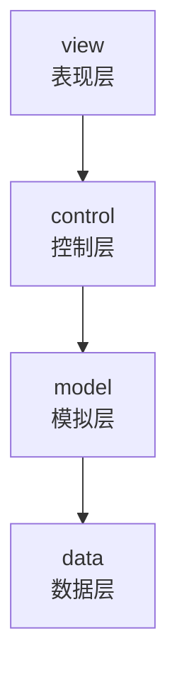

| 层 | 职责 | 关键类 |
|---|---|---|
| **view** | Swing 窗口、画布渲染、鼠标输入、战争迷雾、启动 | `GameFrame`, `GamePanel`, `GameRenderer`, `FogRenderer`, `InputHandler` |
| **control** | 状态机、主循环、布兵逻辑 | `GameStateManager`, `GameLoop`, `DeployController` |
| **model** | 战场世界、单位、各子系统（不依赖 AWT/Swing） | `World`, `Unit`, `GameMap`, 各 `*System`, `Projectile`, `Wreckage` |
| **data** | JSON 解析、配置文件加载 | `Json`, `UnitDefLoader`, `LevelLoader`, `MapLoader` |

### 3.2 游戏总状态机

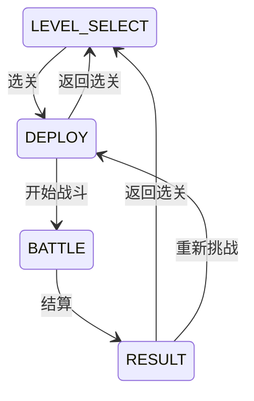

| 状态 | 行为 |
|---|---|
| `LEVEL_SELECT` | 列出关卡，玩家选择 |
| `DEPLOY` | 加载地图和敌方预置；玩家放置己方单位；禁布区蒙版可见 |
| `BATTLE` | 禁用玩家操控，`World.tick()` 以 30 tick/s 自动推演 |
| `RESULT` | 显示胜负与兵力统计；可重新挑战或返回选关 |

---

## 四、模块划分

### 4.1 模拟层（model）

| 模块 | 职责 | 对外接口 | 依赖 |
|---|---|---|---|
| `World` | 持有地图和全部单位，每 tick 按序推进各子系统；提供单位查找、阵营计数 | `tick()`, `addUnit()`, `removeUnit()`, `unitAt()`, `intelOf(faction)`, `countAlive(faction)` | GameMap, Unit, 全部子系统 |
| `GameMap` | 网格地图：地形、可通行性判断、像素/格坐标换算 | `isPassable(cx,cy,mt)`, `isDeployable()`, `cellCenterX/Y()`, `toCol/Row()` | Tile, TerrainType |
| `Unit` / `UnitDef` | 单位运行时状态（位置/HP/朝向/路径/AI状态）+ 静态属性定义（享元共享） | `UnitDef`: 只读属性；`Unit`: 全部字段公开 | AttackProfile, MovementType |
| `VisionSystem` | 每 tick 计算各单位视野范围内的敌方，写入 IntelBoard | `update(World)` | IntelBoard |
| `IntelBoard` | 单阵营已知敌情表：存储敌人引用、最近位置和时间戳 | `report(enemy,x,y,tick)`, `knownEnemies()`, `forget(enemy)` | — |
| `AISystem` | 按角色分派 ScoutAI / StrikeAI；闲置打击超时（90 tick）自动转侦察（`Unit.autoScoutFromStrike` 标记），情报板出现敌人后自动转回打击投入战斗 | `update(World)` | ScoutAI, StrikeAI |
| `ScoutAI` | 侦察 FSM：选最旧未探索区域 → 避战寻路 → 机会主义出击 | `update(Unit, World)` | ExplorationMap, Pathfinder, IntelBoard |
| `StrikeAI` | 打击 FSM：IDLE → MOVING_TO_TARGET → ATTACKING；敌强我弱时 RETREATING | `update(Unit, World)` | Pathfinder, IntelBoard |
| `MovementSystem` | 沿 path 队列按步长推进单位，插值旋转朝向 | `update(World)` | — |
| `CombatSystem` | 选射程内最近的可命中目标，冷却就绪时生成 Projectile 发射至目标当前坐标（FR-21）；记录 ShotEvent 供渲染 | `update(World)` | AttackProfile, Projectile, ProjectileType |
| `Pathfinder` | A* 网格寻路（8 邻接 + Octile 启发式）；可选威胁场避让 | `findPath(mt, start, goal, avoidEnemies, intel)` | GameMap, IntelBoard |
| `ExplorationMap` | 将地图划分为 REGION_SIZE×REGION_SIZE 区块，按阵营记录每块最后访问 tick；为侦察选目标 | `markVisited(faction,x,y,tick)`, `pickGoal(faction,cx,cy,mt)` | GameMap |
| `ProjectileSystem` | 推进所有飞行射弹；到达落点时 BULLET 命中单一目标、SHELL 对溅射半径内所有敌方按距离线性衰减结算伤害；保留炮弹爆炸特效计时后移除 | `update(World)` | Projectile, Unit |
| `Wreckage` | 单位死亡后留下的残骸标记（纯数据）：位置、朝向、死亡贴图路径，供渲染层绘制 | — | — |
| `UnitSpacing` | 单位空间协调工具（model/ai）：检测拥挤、查找未被友方占据的通行格、为接近目标寻找不拥挤落点 | `isCrowded(u,w)`, `findApproachTile(u,w,target,range)`, `findFreeNearbyTile(u,w)` | GameMap, Unit |
| `Projectile` | 飞行射弹实体（纯数据）：弹种、阵营、伤害、溅射半径、当前/目标坐标、飞行速度与朝向 | — | ProjectileType |
| `ProjectileType` | 弹种枚举：BULLET（快速单体）/ SHELL（慢速群体伤害） | — | — |

### 4.2 控制层（control）

| 模块 | 职责 | 对外接口 | 依赖 |
|---|---|---|---|
| `GameStateManager` | 管理选关→布兵→战斗→结算的状态切换 | `getState()`, `setState(s)`, `is(s)` | — |
| `GameLoop` | 用 `javax.swing.Timer` 以 30 tick/s 推进 World；仅在 BATTLE 态推进；检测胜负停止 | `start()`, `stop()`, `setOnVictory(callback)` | World, GameStateManager |
| `DeployController` | 布兵逻辑：管理配额、校验放置合法性、切换选中单位类型和角色 | `tryPlace(px,py)`, `tryRemove(px,py)`, `toggleRoleAt(px,py)`, `remaining()` | World, UnitDefLoader |
| `BattleSetup` | 把关卡定义中的敌方预置单位实例化并放入 World | `placeEnemies(world, level)` | World, UnitDefLoader |

### 4.3 表现层（view）

| 模块 | 职责 | 对外接口 | 依赖 |
|---|---|---|---|
| `GameFrame` | 主窗口：串联全流程，构建侧栏（CardLayout）和战场画布，响应状态切换 | — | 所有 control/model 模块 |
| `GamePanel` | 战场画布：缩放（滚轮）、平移（右键拖拽）、框选、坐标换算 | `worldX/Y(screenX/Y)`, `beginSelection/updateSelection/endSelection()` | World, GameRenderer |
| `GameRenderer` | 纯绘制：地形→装饰→网格→残骸→攻击范围圈/路径→炮口闪光/飞行射弹/爆炸→战争迷雾→单位精灵→选中环→HP条→已知敌情标记 | `render(Graphics2D, World)` | World（只读） |
| `FogRenderer` | 战争迷雾（FR-20）：DEPLOY 模式按可布兵标记蒙版+高斯模糊柔化；BATTLE 模式以友方视野并集擦出径向渐变可视窗口 | `render(Graphics2D, World, Mode)` | World（只读） |
| `InputHandler` | 鼠标事件分发：布兵阶段放置/移除/切换；战斗阶段单击选中/框选 | — | DeployController, GameStateManager, GamePanel |
| `SpriteCache` | 精灵图加载/旋转/缓存：按文件路径+朝向缓存 `BufferedImage`，避免每帧重复 IO 和旋转变换 | `get(path, facing)`, `clear()` | — |
| `TerrainTextures` | 地形纹理管理：从纹理图集中按地形类型裁切子图并缓存，供渲染层绘制地形底纹 | `get(terrain)` | — |
| `StartupDialog` | 模态弹窗选择全屏或窗口分辨率 | `choose()` → `Config` | — |

### 4.4 数据层（data）

| 模块 | 职责 | 对外接口 | 依赖 |
|---|---|---|---|
| `Json` | 手写递归下降 JSON 解析器（对象→`Map`，数组→`List`，数字→`Double`） | `parse(text)`, `parseObject(text)` | — |
| `UnitDefLoader` | 从 `data/units/*.json` 加载全部 UnitDef，按 id 索引 | `get(id)`, `all()` | Json |
| `LevelLoader` | 从 JSON 加载 LevelDef（含 playerBudget 和 enemyUnits） | `loadFile(path)` | Json |
| `MapLoader` | 解析分层 `.map` 文本文件，构建 GameMap | `loadFile(path)` | GameMap, Tile |

### 4.5 音频（audio）

| 模块 | 职责 | 对外接口 | 依赖 |
|---|---|---|---|
| `MusicPlayer` | 后台线程循环播放 OGG：按 Scene 分曲池，切换场景立即换曲；解码失败静默降级 | `start()`, `setScene(Scene)`, `shutdown()` | JOrbis（第三方 JAR） |

---

## 五、数据设计

### 5.1 运行时数据流

**配置加载：**

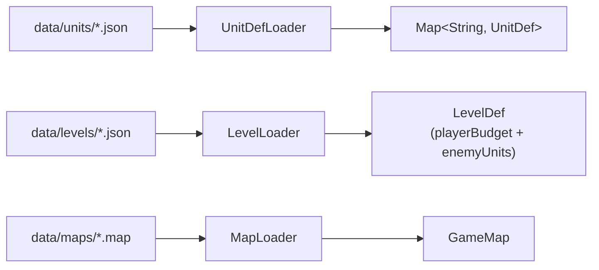

**选关时：**

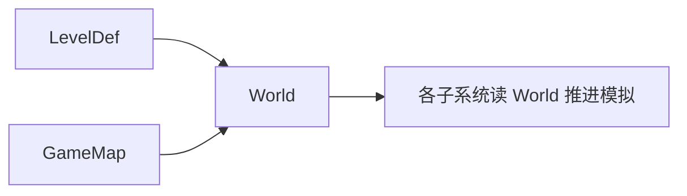

**Tick 内数据流：**

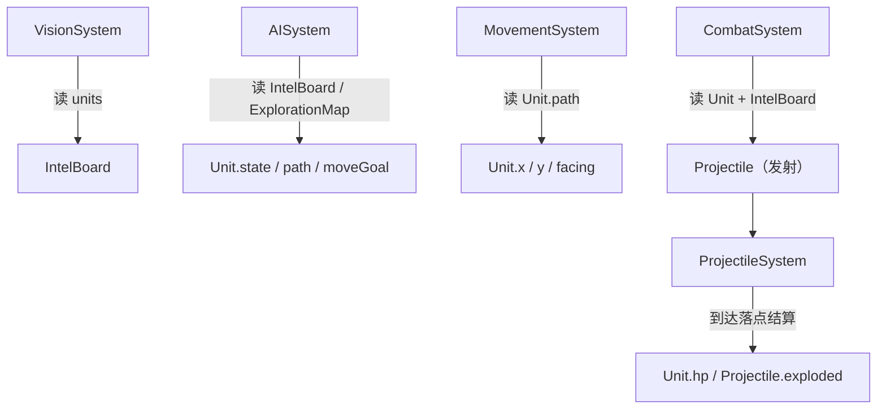

### 5.2 核心数据结构设计

**UnitDef（享元）**：单位类型的静态属性。由 JSON 加载，被同类型的所有 Unit 实例共享。包含 `id`、`displayName`、`maxHp`、`radius`、`movementType`、`moveSpeed`、`sightRange`、`attack`（AttackProfile）、`spritePath`。

**Unit（运行时）**：每个战场上的单位实例。持有 `def`（指向 UnitDef）、`faction`、`x/y`（像素坐标）、`hp`、`facing`（弧度）、`turretFacing`（炮塔朝向，有炮塔单位独立于底座）、`role`（SCOUT/STRIKE，运行时可变）、`state`（AI 状态）、`path`（`Deque<Point>` 格序列）、`moveGoal`（移动终点格）、`currentTarget`、`shootCooldown`（射击冷却剩余 tick）、`lastActiveTick`（最近一次非 IDLE 行动的 tick，用于检测闲置超时）、`autoScoutFromStrike`（标记是否为打击单位因闲置超时自动转侦察，用于发现敌人后立即转回打击）。

**GameMap / Tile**：网格地图。`Tile` 含 `terrain`（TerrainType 枚举，带 `Pass{LAND,WATER,BLOCK}` 通行类别）、`decoration`（纯表现）、`deployable`（布兵允许标记）。`GameMap` 提供 `isPassable(cx,cy,movementType)` 和坐标换算。

**IntelBoard**：单阵营敌情共享板。`VisionSystem` 写入，`ScoutAI`/`StrikeAI` 读取。存储 `Map<Unit, IntelEntry>`，IntelEntry 含 `x/y/lastSeenTick`。

**AttackProfile**：四个布尔攻击域位（`canAttackLand/WaterSurface/Air/Underwater`）+ `maxAttackRange` + `directDamage` + `shootDelay` + `projectileType`（BULLET/SHELL）+ `projectileSpeed`（像素/tick）+ `splashRadius`（仅炮弹，像素）。`canTarget(Unit)` 根据目标 `UnitLayer` 查表。

**Projectile（射弹）**：飞行中的攻击实体（FR-21）。含 `type`（BULLET/SHELL）、`faction`（发射方阵营，防止炮弹误伤友军）、`damage`、`splashRadius`、`x/y`（当前坐标）、`tx/ty`（目标落点，发射瞬间锁定）、`speed`、`facing`（飞行朝向）、`exploded`（是否已到达并结算）、`explosionAge`（爆炸特效持续 tick）。

**Wreckage（残骸）**：单位死亡后遗留的标记（纯数据）。含 `x/y`（位置）、`facing`（朝向）、`deadSpritePath`（残骸贴图路径，由原精灵路径推导 `_dead.png`）。供渲染层在战斗阶段绘制，World.reset() 时清空。

### 5.3 文件格式约定

#### 5.3.1 单位配置格式（`data/units/*.json`）

| 字段 | 类型 | 说明 |
|------|------|------|
| `id` | String | 唯一标识符，关卡配置中引用 |
| `displayName` | String | 游戏内显示名称 |
| `maxHp` | Number | 最大生命值 |
| `radius` | Number | 单位半径（像素） |
| `movementType` | String | 移动类型：`LAND` / `WATER` / `AIR` / `UNDERWATER` |
| `moveSpeed` | Number | 移动速度（像素/tick） |
| `sightRange` | Number | 视野半径（像素） |
| `spritePath` | String（可选） | 单位精灵图路径 |
| `turretSpritePath` | String（可选） | 炮塔精灵图路径 |
| `attack` | Object | 攻击属性，见下表 |

**attack 子字段：**

| 字段 | 类型 | 说明 |
|------|------|------|
| `canAttackLand` | Boolean | 可攻击地面目标 |
| `canAttackWaterSurface` | Boolean | 可攻击水面目标 |
| `canAttackAir` | Boolean | 可攻击空中目标 |
| `canAttackUnderwater` | Boolean | 可攻击水下目标 |
| `maxAttackRange` | Number | 最大攻击射程（像素） |
| `directDamage` | Number | 单次直接伤害 |
| `shootDelay` | Number | 射击冷却时间（tick） |
| `projectileType` | String | 弹种：`"bullet"`（快速单体）/ `"shell"`（慢速群体伤害） |
| `projectileSpeed` | Number | 射弹飞行速度（像素/tick） |
| `splashRadius` | Number（可选） | 群体伤害半径（像素），仅 `"shell"` 类型有效 |

#### 5.3.2 关卡配置格式（`data/levels/*.json`）

| 字段 | 类型 | 说明 |
|------|------|------|
| `id` | String | 关卡唯一标识符 |
| `name` | String | 关卡显示名称 |
| `map` | String | 地图文件路径（相对于 `data/maps/`） |
| `playerBudget` | Object | 玩家可用单位配额，`unitId → 数量` |
| `enemyUnits` | Array | 敌方预置单位列表，每项见下表 |

**enemyUnits 数组项字段：**

| 字段 | 类型 | 说明 |
|------|------|------|
| `unitId` | String | 单位类型 ID，必须在 `data/units/` 中存在 |
| `col` | Number | 初始所在列（格坐标） |
| `row` | Number | 初始所在行（格坐标） |
| `role` | String | 初始角色：`SCOUT` / `STRIKE` |

#### 5.3.3 地图文件格式（`data/maps/*.map`）

文本文件，UTF-8 编码。首行为元数据：

```
cols rows tileSize
```

后续为分层字符网格，以节标题分隔：

| 节标题 | 说明 |
|--------|------|
| `[terrain]` | 地形层（必需） |
| `[decoration]` | 装饰层（可选） |
| `[deploy]` | 玩家布兵许可层（可选） |

**地形字符对照表：**

| 字符 | 地形 | 通行类别 |
|------|------|---------|
| `.` | 草地 | LAND |
| `,` | 泥地 | LAND |
| `s` | 沙地 | LAND |
| `#` | 山地 | BLOCK |
| `_` | 浅水 | WATER |
| `~` | 水域 | WATER |
| `=` | 深水 | WATER |

**地形通行矩阵**（`GameMap.isPassable(cx,cy,movementType)`，✓ 可通行 / ✗ 阻挡）：

| 移动域 \ 通行类别 | LAND（草/泥/沙） | WATER（浅/水/深） | BLOCK（山地） |
|------|:---:|:---:|:---:|
| LAND（陆面） | ✓ | ✗ | ✗ |
| WATER（水面） | ✗ | ✓ | ✗ |
| UNDERWATER（水下） | ✗ | ✓ | ✗ |
| AIR（空中） | ✓ | ✓ | ✓ |

> 空中单位（AIR）无视地形约束，可飞越任意格（含山地与越界判定由 `isPassable` 单独处理）。地图越界一律视为不可通行。

### 5.4 单位属性总表

七种内置单位的静态属性（取自 `data/units/*.json`，供数据驱动加载与攻击域校验追溯）：

| id（显示名） | 移动域 | maxHp | radius | moveSpeed | sightRange | maxRange | directDamage | shootDelay | 弹种 | 弹速 | splashRadius |
|------|------|:---:|:---:|:---:|:---:|:---:|:---:|:---:|------|:---:|:---:|
| light_tank（轻型坦克） | LAND | 210 | 11 | 1.1 | 260 | 130 | 25 | 75 | bullet | 15.0 | — |
| heavy_tank（重型坦克） | LAND | 420 | 14 | 0.85 | 300 | 150 | 35 | 80 | shell | 6.0 | 45 |
| battleship（战列舰） | WATER | 520 | 18 | 0.7 | 360 | 180 | 45 | 110 | shell | 3.2 | 60 |
| destroyer（驱逐舰） | WATER | 320 | 15 | 0.9 | 280 | 140 | 18 | 40 | bullet | 15.0 | — |
| submarine（潜艇） | UNDERWATER | 240 | 13 | 0.8 | 160 | 120 | 50 | 100 | shell | 3.5 | 40 |
| interceptor（拦截机） | AIR | 160 | 10 | 4.0 | 300 | 110 | 20 | 35 | bullet | 15.0 | — |
| bomber（攻击机） | AIR | 200 | 12 | 3.2 | 80 | 40 | 40 | 90 | shell | 3.0 | 50 |

> 弹速与溅射半径若 JSON 省略，则由 `UnitDefLoader` 按弹种赋默认值：bullet → 弹速 8.0 / 无溅射；shell → 弹速 3.0 / 溅射 40。表中均为各单位显式配置值。

---

## 六、关键流程与交互

### 6.1 战斗 tick 流水线

每个逻辑帧（仅 BATTLE 态），`World.tick()` 按固定顺序推进：

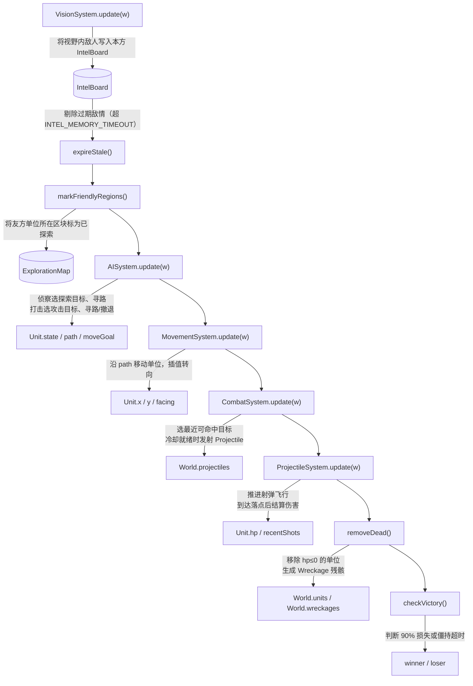

### 6.2 侦察到打击的情报链路

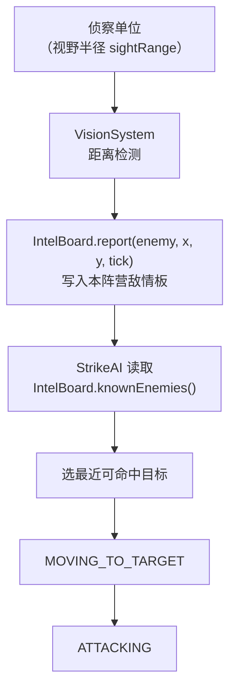

打击单位不依赖自身视野，查询的是本阵营共享的 IntelBoard。侦察单位即使阵亡，已上报的敌情仍可短暂被打击单位利用（直到目标被 removeDead 清理）。

### 6.3 撤退判定流程

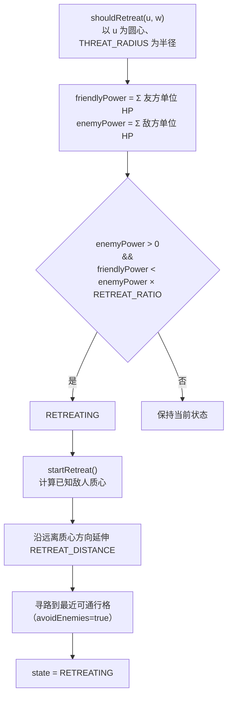

### 6.4 射弹生命周期（FR-21）

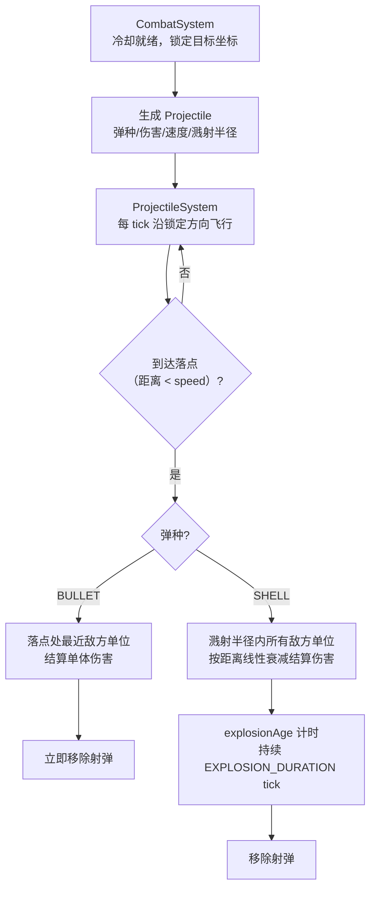

- **BULLET**：飞行速度较快（~15 px/tick），命中单体，无爆炸特效
- **SHELL**：飞行速度较慢（~3–6 px/tick），落点群体伤害，伤害按 `1.0 - 0.75 × (d / splashRadius)` 线性衰减（边缘至少保留 25%）
- 群体伤害仅波及敌方阵营，**不会误伤发射方友军**

### 6.5 战争迷雾渲染流程（FR-20）

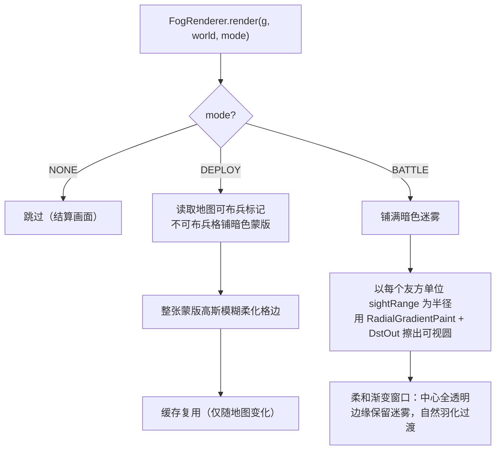

- DEPLOY 模式帮助玩家识别可布兵区域
- BATTLE 模式实现经典 RTS 战争迷雾效果
- 敌方单位在 `InputHandler` 层通过 `hiddenByFog()` 检查，视野外敌人不可见/不可选中

### 6.6 侦察 ↔ 打击角色转换

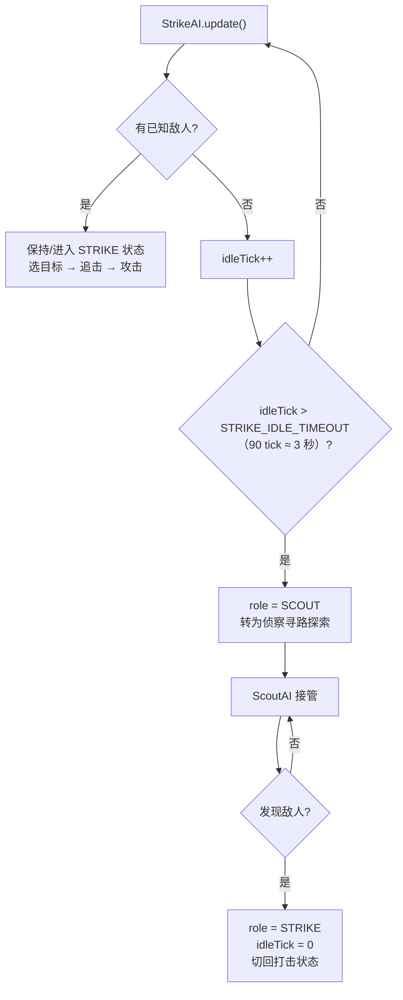

- 闲置打击单位自动转为侦察，充分利用兵力
- 侦察单位发现敌人后立即转回打击，及时投入战斗
- 转换是运行时 `Unit.role` 切换，不需要重新创建单位对象

---

## 七、关键算法设计思路

### 7.1 A* 寻路与威胁场避让

**选型理由**：网格地图、需要最短路径、需要支持额外代价（威胁场）。A* 在网格上表现稳定，Octile 启发式（对角距离）保证 8 邻接下仍是最优。

**威胁场**：当 `avoidEnemies=true`（侦察避战），对距离已知敌人 D 格内的每格叠加额外代价：

```
threatCost(cell) = Σ over knownEnemies where dist ≤ THREAT_RANGE: THREAT_WEIGHT × (THREAT_RANGE − dist) / THREAT_RANGE
```

其中 `THREAT_RANGE = 6`（格），`THREAT_WEIGHT = 4`（单位强度）。靠近已知敌人的格子 `g` 值更高，A* 自然绕开。威胁场半径约 6 格，防止路径过于迂回。

### 7.2 侦察探索策略

地图按 REGION_SIZE=4 格划分为区块。每 tick 将本阵营所有单位所在区块标记为"已访问"（记录 tick 时间戳）。

`pickGoal()`：先按单位 `MovementType` 从当前格做 8 邻接洪泛（`computeReachable`，对角线遵循与 `Pathfinder` 一致的"不穿角"规则），得到真正连通的可达格集合。然后对所有含可达格的区块进行加权评分：

```
score = staleness × 10 + distNorm × 3 − reversePenalty × 4
```

其中 `staleness` 为区块未访问时长（当前 tick − 最后访问 tick，归一化），`distNorm` 为区块到单位的归一化距离（鼓励远行分散探索），`reversePenalty` 为折返惩罚（当候选区块方向与单位当前朝向夹角余弦 < 0 时施加，抑制原路来回往返）。评分后选最高分区块，直接返回该区块内一处可达格作为路径终点。

此前的"最旧 tick + 取最远"硬排序曾导致单位在对角线两端来回往返、覆盖不到对角线以外区域；加权评分 + 折返惩罚改善了覆盖均匀性。可达性过滤则修复了潜艇/水面单位因被分配到不连通水域而原地冻结的问题。

### 7.3 攻击域克制规则

借鉴 RustedWarfare 的攻击开关，扩展为四个布尔位：

| 单位 | 移动域 | 打地 | 打水面 | 打空 | 打水下 |
|---|---|---|---|---|---|
| 轻型坦克 | LAND | ✓ | ✓ | ✗ | ✗ |
| 重型坦克 | LAND | ✓ | ✓ | ✓ | ✗ |
| 战列舰 | WATER | ✓ | ✓ | ✗ | ✗ |
| 驱逐舰 | WATER | ✓ | ✓ | ✓ | ✓ |
| 潜艇 | UNDERWATER | ✗ | ✓ | ✗ | ✓ |
| 拦截机 | AIR | ✗ | ✗ | ✓ | ✗ |
| 攻击机 | AIR | ✓ | ✓ | ✗ | ✗ |

> 注：`bomber.json` 的 `displayName` 为「攻击机」（早期文档曾称「轰炸机」，以游戏内显示名为准）。

`UnitLayer` 由 `MovementType` 推导：`LAND→LAND, WATER→WATER, AIR→AIR, UNDERWATER→UNDERWATER`。`AttackProfile.canTarget(Unit)` 根据目标 layer 查四个布尔位。

| 弹种 | 说明 | 飞行速度 | 伤害模式 |
|---|---|---|---|
| BULLET | 快速单体 | 15 px/tick | 落点处最近敌方单体，命中即移除 |
| SHELL | 慢速群体 | 3–6 px/tick | 溅射半径内全体敌方按距离衰减，保留爆炸特效 12 tick |

### 7.4 射弹飞行与伤害结算

射弹每 tick 沿锁定方向（发射瞬间指向目标位置的单位向量）前进 `speed` 像素。当与落点距离 ≤ 一步时判为到达并触发结算。落点坐标在发射时锁定，不会追踪目标移动——目标可通过移动规避慢速炮弹。

**伤害衰减公式（仅炮弹）**：

```
damage = directDamage × (1.0 - 0.75 × d / splashRadius)
```

其中 `d` 为单位到落点距离。边缘伤害至少保留 25%，避免远距离几乎无效。群体伤害仅波及敌方阵营（`faction` 判断），不会误伤发射方友军。

### 7.5 战争迷雾渲染算法

**布兵阶段（DEPLOY 模式）**：遍历地图全部格子，对 `deployable=false` 的格子铺暗色蒙版 (`Color(8,12,24,210)`)。对整张蒙版做二维高斯卷积（σ = FEATHER_RADIUS/2，核大小 `2R+1`×`2R+1`），使硬质格边柔化为羽化过渡。结果按地图引用缓存，仅在切换地图时重建。

**战斗阶段（BATTLE 模式）**：
1. 铺满整张地图暗色迷雾
2. 以 `AlphaComposite.DstOut` 在每个友方单位位置以 `sightRange` 为半径画 `RadialGradientPaint` 圆
3. 渐变参数：`[0f, 0.7f, 1f]` 对应透明度 `[255, 230, 0]` — 圆心完全透明（视野清晰），接近边缘逐渐不透明（信息递减），边缘外完全遮蔽
4. 多个视野圆自然叠加形成"视野并集"效果

### 7.6 单位空间协调（UnitSpacing）

防止多个同阵营单位挤在同一位置，影响战术展开：

- **拥挤检测**：任意两友方单位间距 < `MIN_SEPARATION`（16px）视为拥挤
- **占格检查**：`tileTakenByFriendly()` 将友方当前位置与 `moveGoal` 均视为"已预订"，规划路径时主动避让
- **接近落点**：`findApproachTile()` 在目标周围由近及远搜索（同心菱形展开），返回首个可通行且未被占据的格，且该格中心落在给定射程范围内
- **脱困**：`findFreeNearbyTile()` 在自身周围 5 格内搜索空闲可通行格用于错开

---

## 八、扩展方向

以下特性当前未实现，但架构上已预留扩展空间：

- **联网对战**：`World.tick()` 是确定性模拟，可序列化状态帧做同步。
- **关卡编辑器**：读取/写出 `.map` 和关卡 JSON，model 层已提供完整读写能力。
- **音效系统**：当前仅有背景音乐（MusicPlayer），可扩展为事件驱动音效（开火、爆炸、单位选中等）。
- **小地图**：可基于 IntelBoard + ExplorationMap 生成阵营视野概览缩略图。
- **Mod 系统**：数据驱动架构天然支持——替换 `data/` 下 JSON 和素材即可。
