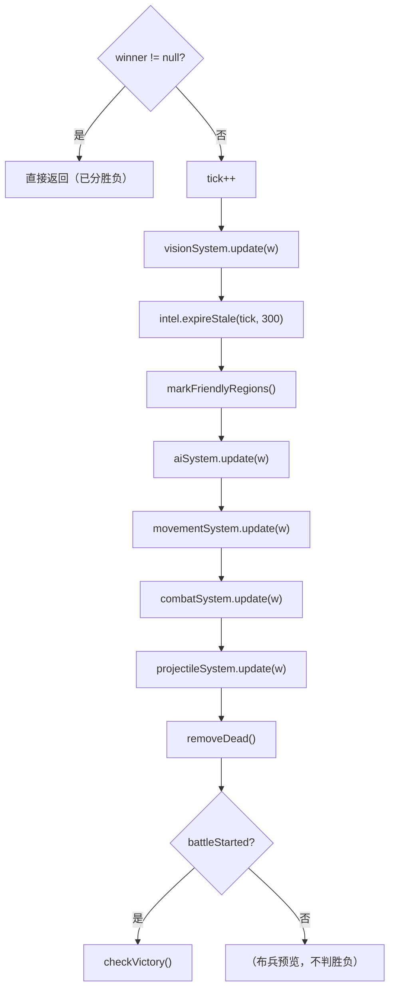
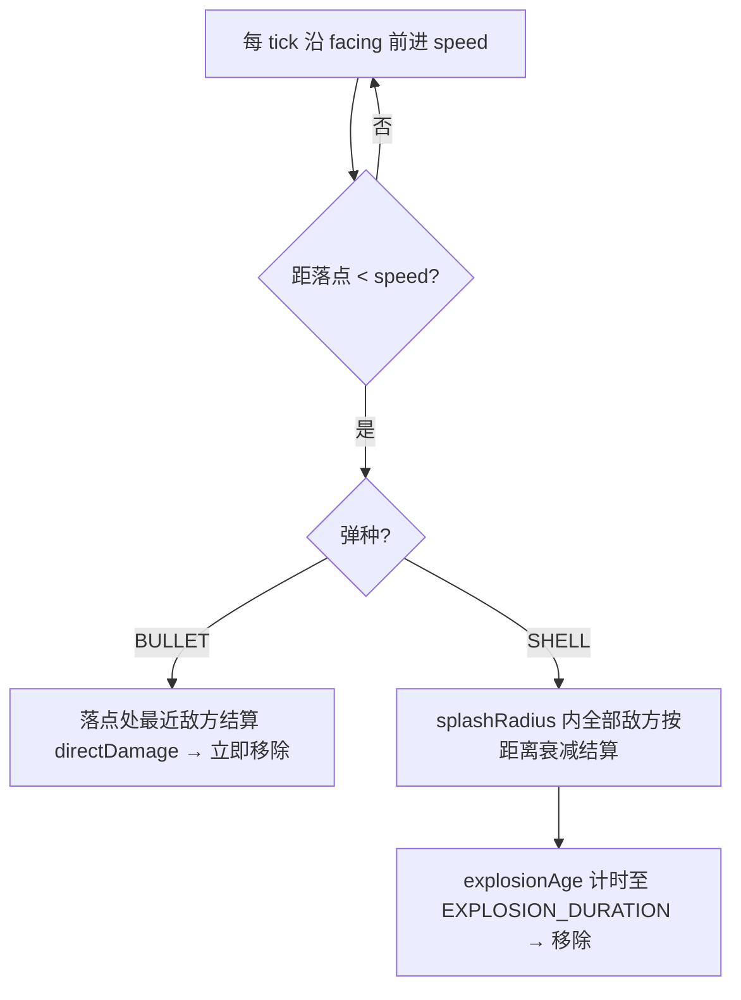
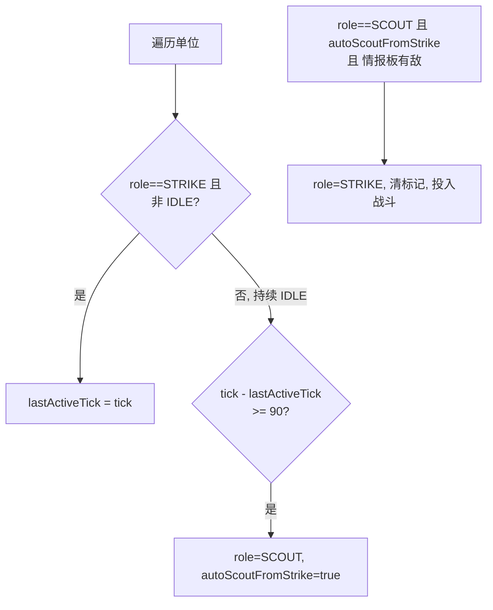
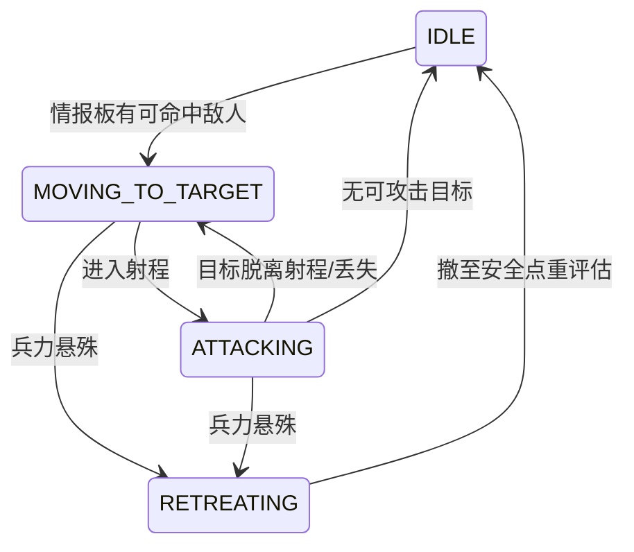

# 详细设计说明书

## 一、引言

### 1.1 编写目的

本文档在《概要设计说明书》给出的分层架构与模块划分基础上，进一步描述 GDUWS 各核心类的**字段结构、方法签名、关键算法与状态机**，作为编码实现与单元测试设计的直接依据。文档内容与 `GDUWS/code/src/main/java/com/gduws/` 下的实际代码保持一致。

### 1.2 参考文档

- 《需求分析说明书》（FR-01~FR-38、BR-02-1~BR-04-3、NFR-01~NFR-12）
- 《概要设计说明书》（§三 分层架构、§四 模块划分、§五 数据设计、§七 关键算法）
- 《实现说明》（与概要设计的实际差异纪实）

### 1.3 设计范围

本文档重点描述**模拟层（model）、AI 子层（model/ai）、控制层（control）、数据层（data）**——这些是确定性、可单元测试的核心逻辑。表现层（view）与音频层（audio）涉及 Swing 渲染与后台线程，仅作接口级概述（详见《实现说明》§七）。

### 1.4 术语与约定

- **tick**：逻辑帧，1 秒 = 30 tick（`GameLoop.TICKS_PER_SECOND`）。
- **格坐标 / 像素坐标**：`(cx, cy)` 为网格列行；`(px, py)` 为像素。换算由 `GameMap` 提供。
- 字段表中 `final` 表示构造后不可变；方法签名采用 Java 形式。
- 模型层严禁 import `java.awt.*`/`javax.swing.*`（仅允许 `java.awt.Point` 作纯坐标容器）。

---

## 二、系统设计总览

### 2.1 包结构

```
com.gduws
├── Main                                  程序入口
├── model/                                模拟层（确定性，无 Swing）
│   ├── 枚举  MovementType / Faction / TerrainType / UnitRole
│   │        / UnitState / UnitLayer / ProjectileType
│   ├── AttackProfile / UnitDef / Unit    单位静态定义与运行时实例
│   ├── Tile / GameMap                    网格地图
│   ├── World                             聚合根，持有全部状态与子系统
│   ├── VisionSystem / IntelBoard         视野与情报
│   ├── Pathfinder / MovementSystem       寻路与移动
│   ├── CombatSystem / Projectile / ProjectileSystem / ProjectileType  战斗与射弹
│   ├── ExplorationMap                    侦察探索区块记录
│   ├── Wreckage                          残骸标记
│   └── ai/  AISystem / ScoutAI / StrikeAI / UnitSpacing
├── control/  GameState / GameStateManager / GameLoop / DeployController / BattleSetup
├── view/     GameFrame / GamePanel / GameRenderer / FogRenderer / InputHandler
│             / SpriteCache / TerrainTextures / StartupDialog
├── data/     Json / UnitDefLoader / LevelLoader / LevelDef / MapLoader
└── audio/    MusicPlayer
```

### 2.2 控制反转关系

`World` 是模拟层聚合根，**持有并按固定顺序调用**各子系统；子系统是"近似无状态的算子"（除 `CombatSystem.recentShots`、`ExplorationMap` 的访问表外不保留跨 tick 状态），统一以 `update(World)` 为入口读写 `World`。控制层 `GameLoop` 仅在 `BATTLE` 态以 30 tick/s 调用 `World.tick()`。

### 2.3 单帧流水线（`World.tick()`）



> 顺序固定不可调换：视野先于 AI（AI 依赖最新情报）、移动先于战斗（先就位再开火）、射弹结算后再清理死亡单位、最后判胜负。对应代码 `World.java:154-171`。

---

## 三、模型层详细设计

### 3.1 枚举

| 枚举 | 取值 | 说明 |
|------|------|------|
| `MovementType` | `LAND` / `WATER` / `AIR` / `UNDERWATER` | 单位移动域，决定可通行地形 |
| `Faction` | `PLAYER` / `ENEMY` | 阵营 |
| `UnitRole` | `SCOUT` / `STRIKE` | 任务角色，运行时可变（`Unit.role`） |
| `UnitState` | `IDLE` / `SCOUTING` / `MOVING_TO_TARGET` / `ATTACKING` / `RETREATING` / `DEAD` | AI 状态机状态 |
| `UnitLayer` | `LAND` / `WATER` / `AIR` / `UNDERWATER` | 目标高度层，由 `MovementType` 1:1 推导，供攻击域查表 |
| `ProjectileType` | `BULLET` / `SHELL` | 弹种：快速单体 / 慢速群体 |
| `TerrainType` | `GRASS` / `DIRT` / `SAND` / `MOUNTAIN` / `SHALLOW` / `WATER` / `DEEP` | 地形；各自带 `Pass{LAND, WATER, BLOCK}` 通行类别 |

### 3.2 `UnitDef`（单位静态定义，享元）

由 `UnitDefLoader` 从 JSON 加载，同类型所有 `Unit` 实例共享一份。

| 字段 | 类型 | 说明 |
|------|------|------|
| `id` | `String` | 唯一标识（如 `"light_tank"`） |
| `displayName` | `String` | 显示名 |
| `maxHp` | `int` | 最大生命值 |
| `radius` | `double` | 碰撞/选择半径（像素） |
| `movementType` | `MovementType` | 移动域 |
| `moveSpeed` | `double` | 每 tick 位移（像素） |
| `sightRange` | `int` | 视野半径（像素） |
| `attack` | `AttackProfile` | 攻击属性 |
| `spritePath` / `turretSpritePath` | `String` | 底座/炮塔贴图路径，均可为 null（炮塔为空表示无独立炮塔） |

> `role` 不在 `UnitDef` 中——见《实现说明》§四.1：角色是运行时属性。

### 3.3 `AttackProfile`（攻击属性）

| 字段 | 类型 | 默认 | 说明 |
|------|------|------|------|
| `canAttackLand` / `canAttackWaterSurface` / `canAttackAir` / `canAttackUnderwater` | `boolean` | — | 四维攻击域开关 |
| `maxAttackRange` | `int` | — | 最大射程（像素） |
| `directDamage` | `int` | — | 单次直接伤害 |
| `shootDelay` | `int` | — | 射击冷却（tick） |
| `projectileType` | `ProjectileType` | `BULLET` | 弹种 |
| `projectileSpeed` | `double` | `8.0` | 飞行速度（像素/tick） |
| `splashRadius` | `int` | `0` | 溅射半径，仅 SHELL > 0 |

**方法：**

```java
boolean canAttackAnything();          // 四个攻击域有任一为真
boolean canTarget(Unit target);       // 按 target.layer() 查对应攻击域布尔位
```

`canTarget` 是攻击域克制规则（《概要设计》§7.3 矩阵）的唯一裁决点：按 `target.layer()` 返回 `LAND→canAttackLand`、`WATER→canAttackWaterSurface`、`AIR→canAttackAir`、`UNDERWATER→canAttackUnderwater`。

### 3.4 `Unit`（运行时实例）

| 字段 | 类型 | 说明 |
|------|------|------|
| `def` | `final UnitDef` | 指向静态定义 |
| `faction` | `final Faction` | 阵营 |
| `x, y` | `double` | 战场像素坐标 |
| `facing` | `double` | 底座朝向（弧度），随移动改变 |
| `turretFacing` | `double` | 炮塔朝向（弧度），随攻击目标改变 |
| `hp` | `int` | 当前生命值 |
| `state` | `UnitState` | AI 状态，初始 `IDLE` |
| `shootCooldown` | `int` | 射击冷却剩余 tick |
| `currentTarget` | `Unit` | 当前攻击目标 |
| `path` | `Deque<Point>` | 当前路径（格序列） |
| `moveGoal` | `Point` | 移动终点（格） |
| `lastActiveTick` | `int` | 最近一次有效行动（移动/攻击/撤退）的 tick，用于检测闲置 |
| `role` | `UnitRole` | 任务角色，运行时可变 |
| `autoScoutFromStrike` | `boolean` | 标记是否为打击单位因闲置超时自动转侦察 |

**方法：**

```java
Unit(UnitDef def, Faction faction, double x, double y);
UnitLayer layer();        // 由 def.movementType 推导目标高度层
boolean isDead();         // hp <= 0
```

### 3.5 `Tile` / `GameMap`（网格地图）

`Tile` 字段：`terrain`（`TerrainType`）、`decoration`（`Decoration`，纯表现）、`deployable`（`boolean`，布兵许可）。

`GameMap` 字段：`final int cols, rows, tileSize`（tileSize=20，与参考项目一致）、`Tile[][] tiles`。

**方法签名：**

```java
Tile    tileAt(int cx, int cy);
boolean inBounds(int cx, int cy);
boolean isPassable(int cx, int cy, MovementType mt);     // 地形通行矩阵裁决
boolean isDeployable(int cx, int cy, MovementType mt);   // 可通行 且 deployable 且 非禁布
boolean isDeployForbidden(int cx, int cy);               // 越界不算禁布
int     toCol(double px);  int toRow(double py);
double  cellCenterX(int cx);  double cellCenterY(int cy);
int     pixelWidth();  int pixelHeight();
Point   findNearestPassable(int cx, int cy, MovementType mt, int radius);  // 同心搜索最近可通行格
```

通行矩阵（`isPassable`）：LAND→仅 LAND 地形；WATER/UNDERWATER→仅 WATER 地形；AIR→任意格（含山地）；越界一律不可通行。（详见《概要设计》§5.3.3）

### 3.6 `World`（聚合根）

| 字段 | 类型 | 说明 |
|------|------|------|
| `map` | `final GameMap` | 地图 |
| `units` | `final List<Unit>` | 全部单位 |
| `wreckages` | `final List<Wreckage>` | 残骸 |
| `projectiles` | `final List<Projectile>` | 飞行射弹 |
| `intel` | `EnumMap<Faction, IntelBoard>` | 每阵营情报板 |
| `tick` | `int` | 帧计数 |
| `winner` | `Faction` | 胜方，未分出为 null |
| `battleStarted` | `boolean` | 是否已 `startBattle()`（控制是否判胜负） |
| `totalAlive` / `lastLossTick` | `int` | 僵持检测：总存活数与最近损失 tick |

私有常量：`STALEMATE_TIMEOUT = 2500`（僵持超时 tick）、`INTEL_MEMORY_TIMEOUT = 300`（情报记忆超时 tick）。

**对外接口：**

```java
World(GameMap map);
void addUnit(Unit u);  void removeUnit(Unit u);  void addProjectile(Projectile p);
Unit unitAt(double px, double py, double radius);     // 命中测试（选中/放置校验）
List<Unit> unitsWithin(double px, double py, double radius);
int  countAlive(Faction f);  int initialCountOf(Faction f);
IntelBoard intelOf(Faction f);
Pathfinder pathfinder();  ExplorationMap exploration();  CombatSystem combatSystem();
int  tickCount();  Faction winner();
void startBattle();   // 记录初始兵力基线，置 battleStarted=true
void reset();         // 清空单位/残骸/射弹/情报，支持无重启重玩
void tick();          // 单帧推进（见 §2.3）
```

**胜负判定算法（`checkVictory`，BR-04-1/2/3）：**

```
nowAlive = countAlive(PLAYER) + countAlive(ENEMY)
if (nowAlive < totalAlive) lastLossTick = tick     // 有损失则刷新时间戳
totalAlive = nowAlive

for f in {PLAYER, ENEMY}:
    init = initialCountOf(f); if init<=0 continue
    lossRatio = 1 - alive/init
    if (lossRatio > 0.9) loser = f      // 严格大于：恰好 90% 损失不触发（BR-04-1）
if (loser==null && tick - lastLossTick >= STALEMATE_TIMEOUT)
    loser = higherLossFaction()         // 僵持：损失率高者负，相等→ENEMY（玩家胜）
if (loser!=null): winner = 另一方; 清空所有单位 path/moveGoal
```

> 边界：`> 0.9` 严格，小于 10% 存活才判负，对应已修复缺陷 BUG-001（《测试设计》§十 D-1）。

### 3.7 `VisionSystem` / `IntelBoard`

`VisionSystem.update(World)`：遍历每个存活单位，对所有敌方单位做距离检测，距离 ≤ `sightRange` 则 `intelOf(本方).report(enemy, ex, ey, tick)`。友方不计，双方各自独立记录（BR-03-1/2）。

`IntelBoard` 持有 `Map<Unit, IntelEntry>`，`IntelEntry{enemy, x, y, lastSeenTick}`。

```java
void report(Unit enemy, double x, double y, int tick);   // 新增或更新位置+时间戳
void forget(Unit enemy);
void expireStale(int currentTick, int timeout);          // 剔除 currentTick-lastSeen > timeout 的条目
void clearAll();
boolean hasAnyEnemy();
Collection<IntelEntry> knownEnemies();
```

### 3.8 `Pathfinder`（A* + 威胁场）

常量：`SQRT2`、`THREAT_RANGE = 6`（格）、`THREAT_WEIGHT = 4`。

```java
Deque<Point> findPath(Unit u, double goalPxX, double goalPxY, boolean avoidEnemies, IntelBoard enemyIntel);
Deque<Point> findPath(MovementType mt, int sc, int sr, int gc, int gr, boolean avoidEnemies, IntelBoard enemyIntel);
```

**算法要点：**
- 8 邻接网格 A*，启发式为 Octile 距离；对角移动遵循"不穿角"规则（两正交格须均可通行）。
- 终点越界或不可通行 → 返回 `null`；起点即终点 → 返回空队列；返回的队列从"下一步"起、以终点结尾。
- `avoidEnemies=true` 时叠加威胁代价：对每格累加距已知敌人 D 格内的代价
  `Σ THREAT_WEIGHT × (THREAT_RANGE − D) / THREAT_RANGE`（D < THREAT_RANGE），使路径自然绕开敌人（BR-03-4）。

### 3.9 `ExplorationMap`（侦察探索）

常量 `REGION_SIZE = 4`：地图按 4×4 格划为区块，`regionCols/regionRows = ceil(格/4)`，按阵营记录每块最后访问 tick。

```java
void  clear();
void  markVisited(Faction faction, double px, double py, int tick);
Point pickGoal(Faction faction, int fromCx, int fromCy, MovementType mt);
Point pickGoal(Faction faction, int fromCx, int fromCy, MovementType mt, double facing);
```

**`pickGoal` 加权评分算法（BR-03-3 配套）：**
1. 按 `mt` 从当前格做 8 邻接洪泛 `computeReachable`（与 Pathfinder 同样"不穿角"），得真正连通的可达格集合——**只考虑含可达格的区块**，修复潜艇/水面单位被分到不连通水域而原地冻结的缺陷。
2. 对候选区块评分：`score = staleness×10 + distNorm×3 − reversePenalty×4`
   - `staleness`：未访问时长（归一化）；`distNorm`：到单位的归一化距离（鼓励奔远）；
   - `reversePenalty`：候选方向与 `facing` 夹角余弦 < 0 时施加（抑制原路折返）。
3. 取最高分区块，返回块内一处可达格作为路径终点。

### 3.10 `MovementSystem`

常量 `MAX_TURN_PER_TICK = π/16`。`update(World)`：对每个有 `path` 的单位，朝队首格中心按 `moveSpeed` 推进；到达则吸附并出队；底座 `facing` 向行进方向插值旋转，**单 tick 转角不超过 π/16**（BR-03-5）。无 path 不移动。

### 3.11 `CombatSystem` / `Projectile` / `ProjectileSystem`

**`CombatSystem.update(World)`**：对每个单位选射程内、`canTarget` 通过的**最近**敌方为目标；炮塔/底座转向目标；`shootCooldown` 归零时**发射一枚 `Projectile`**（落点锁定目标当前坐标）并重置冷却为 `shootDelay`，同时记录 `ShotEvent` 供渲染炮口闪光。冷却期不重复开火。
- `recentShots: List<ShotEvent>`，`ShotEvent{sx, sy, tx, ty, shooterFaction}`。

**`Projectile`**（纯数据）：`final type/faction/damage/splashRadius/tx/ty/speed`，可变 `x/y/facing/exploded/explosionAge`。`isSplash()` 即 `type==SHELL`。

**`ProjectileSystem.update(World)`**（FR-21，常量 `EXPLOSION_DURATION = 12`）：



- 群体伤害衰减：`damage = directDamage × (1 − 0.75 × d/splashRadius)`，边缘至少保留 25%；
- 仅波及**敌方**阵营（按 `faction` 排除发射方友军），不误伤友军。

### 3.12 `Wreckage`

纯数据：`x, y, facing, deadSpritePath`。`removeDead()` 时由原 `spritePath` 推导 `_dead.png` 生成，供渲染层绘制；`reset()` 清空。

---

## 四、AI 子层详细设计（`model/ai`）

### 4.1 `AISystem`

常量 `STRIKE_IDLE_TIMEOUT = 90`。`update(World)`：按 `Unit.role` 分派 `ScoutAI` / `StrikeAI`；并执行**角色自动转换**（BR-03-6）：



### 4.2 `ScoutAI`（侦察 FSM）

常量：`REPLAN_INTERVAL = 30`、`DANGER_RADIUS = 200`、`DANGER_ENEMY_COUNT = 3`、`ENGAGE_RADIUS = 260`、`ENGAGE_POWER_RATIO = 1.5`。

`update(Unit, World)`：状态恒为 `SCOUTING`。
- 由 `ExplorationMap.pickGoal()` 选探索目标，`findPath(avoidEnemies=true)` 绕开已知敌人；避战寻路失败时兜底退化为不避战直达。
- **避战**：`DANGER_RADIUS` 内已知敌人 ≥ `DANGER_ENEMY_COUNT` 时优先远离。
- **机会主义出击**：`ENGAGE_RADIUS` 内 友方 HP ≥ 敌方 HP × `ENGAGE_POWER_RATIO(1.5)` 时主动接敌（FR-15）。

### 4.3 `StrikeAI`（打击 FSM）

常量：`THREAT_RADIUS = 220`、`RETREAT_RATIO = 0.5`、`RETREAT_DISTANCE = 260`、`REPLAN_INTERVAL = 20`。



- 目标来自本阵营 `IntelBoard`（不依赖自身视野）；追击距离 = `maxAttackRange × PURSUE_RATIO(0.9)`。
- **撤退判定**（BR-03-7）：`THREAT_RADIUS` 内 友方 HP < 敌方 HP × `RETREAT_RATIO(0.5)`（即敌方 > 友方 2 倍）→ 计算已知敌人质心，沿反方向延伸 `RETREAT_DISTANCE`，`findPath(avoidEnemies=true)` 撤离。

### 4.4 `UnitSpacing`（空间协调工具）

常量 `MIN_SEPARATION = 16`、`PURSUE_RATIO = 0.9`。静态方法：

```java
boolean isCrowded(Unit u, World w);                          // 与友方间距 < MIN_SEPARATION
boolean tileTakenByFriendly(Unit self, World w, int col, int row);  // 友方当前位置/moveGoal 均视为已占
Point   findApproachTile(Unit u, World w, Unit target, double range); // 同心菱形找射程内空闲落点
Point   findFreeNearbyTile(Unit u, World w);                // 周边 5 格找空闲格脱困
```

---

## 五、控制层详细设计（`control`）

### 5.1 `GameState` / `GameStateManager`

`GameState` 枚举：`LEVEL_SELECT → DEPLOY → BATTLE → RESULT`。`GameStateManager`：`getState() / setState(s) / is(s)`。

### 5.2 `GameLoop`

常量 `TICKS_PER_SECOND = 30`。用 `javax.swing.Timer`（回调在 EDT，刻意与渲染共线程避免同步问题）。

```java
GameLoop(World world, GameStateManager stateManager, Runnable afterTick);
void setOnVictory(Consumer<Faction> onVictory);
void start();  void stop();
```

仅在 `BATTLE` 态调用 `world.tick()`；检测到 `winner != null` 时回调 `onVictory` 并停止。

### 5.3 `DeployController`（布兵逻辑，BR-02-1~4）

```java
DeployController(World world, UnitDefLoader unitDefs, LevelDef level);
void reset(LevelDef level);
Map<String,Integer> remaining();          // 各单位剩余配额
String selectedUnitId();  void selectUnit(String unitId);
UnitRole deployRole();   void setDeployRole(UnitRole role);  // 默认 STRIKE
String lastMessage();                      // 操作失败文字提示
boolean tryPlace(double px, double py);    // 校验配额/地形/禁布/重叠后放置
boolean tryRemove(double px, double py);   // 右键移除并返还配额
boolean toggleRoleAt(double px, double py);// 左键切换 SCOUT/STRIKE
UnitDef defOf(String unitId);
```

`tryPlace` 校验顺序：选中类型有剩余配额 → 目标格 `isDeployable(mt)` → 该格无单位（`unitAt`）；任一不满足返回 false 并设置 `lastMessage`。

### 5.4 `BattleSetup`

```java
BattleSetup(UnitDefLoader unitDefs);
void placeEnemies(World world, LevelDef level);  // 将 level.enemyUnits 实例化置入 World
```

---

## 六、数据层详细设计（`data`）

### 6.1 `Json`（手写递归下降解析器，NFR-04/NFR-10）

```java
static Object parse(String text);              // 对象→Map, 数组→List, 数字→Double, 其余 String/Boolean/null
static Map<String,Object> parseObject(String text);
```

容错：尾随字符、未闭合字符串、非法字面量、顶层非对象、缺逗号等均抛 `IllegalArgumentException`；保持对象键插入顺序（`LinkedHashMap`）。

### 6.2 加载器

```java
// UnitDefLoader
void loadDirectory(Path dir) throws IOException;
UnitDef loadFile(Path file) throws IOException;   // 缺必填字段抛异常；弹种/弹速/溅射按缺省补全
UnitDef get(String id);  Map<String,UnitDef> all();

// LevelLoader
LevelDef loadFile(Path file) throws IOException;  // playerBudget + enemyUnits；role 缺省 STRIKE

// MapLoader
GameMap loadFile(Path file) throws IOException;   // 首行 cols rows tileSize；分层 [terrain]/[decoration]/[deploy]
                                                  // 缺头行/地形行数不足抛 IOException；兼容旧单层格式
```

弹种缺省（`UnitDefLoader`）：`projectileType` 缺省 BULLET；`projectileSpeed` 缺省 子弹 8.0 / 炮弹 3.0；`splashRadius` 缺省 炮弹 40 / 子弹 0。

---

## 七、表现层与音频层（接口级概述）

表现层为纯渲染/输入，不修改模拟逻辑（详见《概要设计》§4.3、《实现说明》§七）：

| 类 | 职责 |
|----|------|
| `GameFrame` | 主窗口，`CardLayout` 侧栏串联四态 |
| `GamePanel` | 战场画布：缩放（滚轮锚点）、平移（右键拖拽）、框选、坐标换算 |
| `GameRenderer` | 按固定顺序绘制：地形→装饰→网格→残骸→范围圈/路径→炮口闪光/射弹/爆炸→战争迷雾→单位→选中环→HP 条→情报标记 |
| `FogRenderer` | 战争迷雾（FR-20）：DEPLOY 按可布兵标记+高斯模糊；BATTLE 以友方视野并集 `DstOut` 擦出渐变窗口 |
| `InputHandler` | 鼠标事件分发；`hiddenByFog()` 裁决敌方可见性（FR-11） |
| `SpriteCache` / `TerrainTextures` | 贴图按路径+朝向 / 地形类型缓存 |
| `StartupDialog` | 模态选择全屏/窗口 |
| `MusicPlayer`（audio） | JOrbis 解码 OGG，按 Scene 分曲池随机循环；解码失败静默降级（FR-37/NFR-04） |

---

## 八、错误处理与边界设计

| 场景 | 处理 | 关联 |
|------|------|------|
| 配置文件缺失/格式错误 | 加载器抛 `IOException`/`IllegalArgumentException`，明确报错拒绝启动 | NFR-04 |
| 地图行数不足/缺头行 | `MapLoader` 抛 `IOException` | NFR-04 |
| 关卡引用不存在单位 id | `UnitDefLoader.get` 返回 null → 装配处抛异常 | NFR-04 |
| 寻路终点不可达/越界 | `findPath` 返回 null；调用方兜底（侦察退化直达、打击保持原状态） | BR-03-3 |
| 不连通水域目标 | `pickGoal` 仅在可达区块选点，避免原地冻结 | BR-03-3 |
| 音频不可用 | `MusicPlayer` 静默降级，游戏正常运行 | FR-37 |
| 恰好 90% 损失 | `lossRatio > 0.9` 严格，不误判 | BR-04-1 |

---

## 九、详细设计追溯

| 详细设计条目 | 概要设计 | 需求 |
|------|------|------|
| §3.6 `World.tick` 流水线 | §6.1 | FR-14 |
| §3.6 `checkVictory` | §6 结算 | FR-24/25、BR-04-1/2/3 |
| §3.7 视野与情报 | §6.2 | FR-16/20、BR-03-1/2 |
| §3.8 A*+威胁场 | §7.1 | FR-15、BR-03-3/4 |
| §3.9 探索评分 | §7.2 | FR-15 |
| §3.11 战斗与射弹 | §6.4、§7.3/7.4 | FR-17/21、BR-03-5 |
| §4.1 角色自动转换 | §6.6 | FR-19、BR-03-6 |
| §4.3 撤退判定 | §6.3 | FR-18、BR-03-7 |
| §5.3 布兵控制 | §4.2 | FR-05~09、BR-02-1~4 |
| §6 数据加载 | §4.4、§5.3 | NFR-04/09 |

---

**文档状态**：首版，依据 `code/src/main/java/com/gduws/` 实际实现编写，与《需求分析说明书》《概要设计说明书》《测试设计说明书》交叉对齐。
**下次审查**：核心模拟逻辑或类接口变更时。
