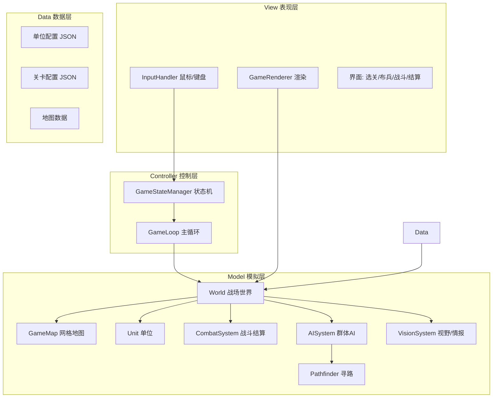
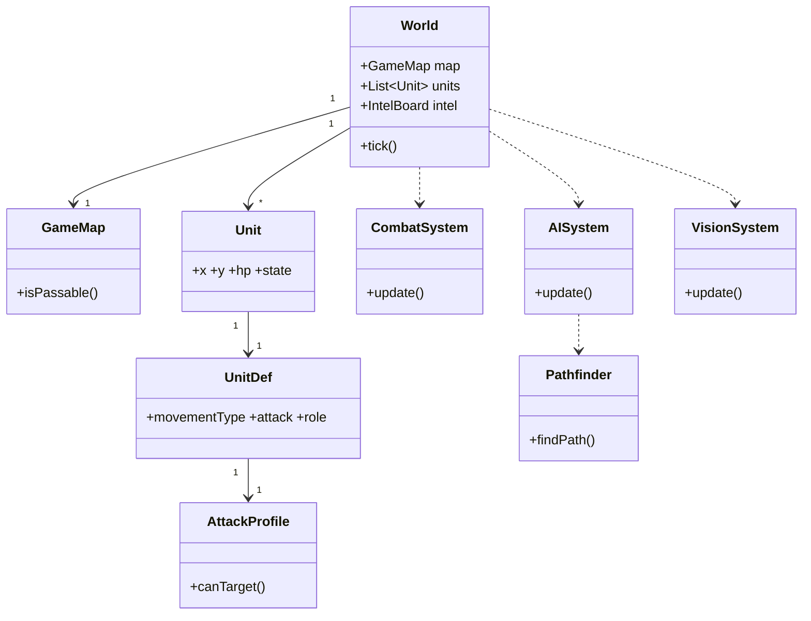
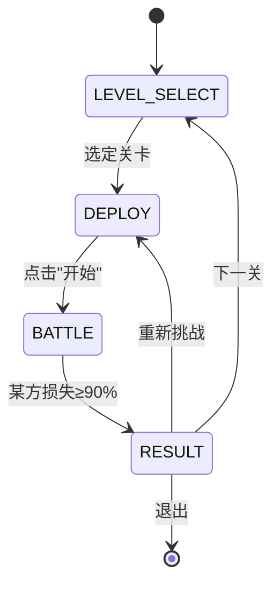
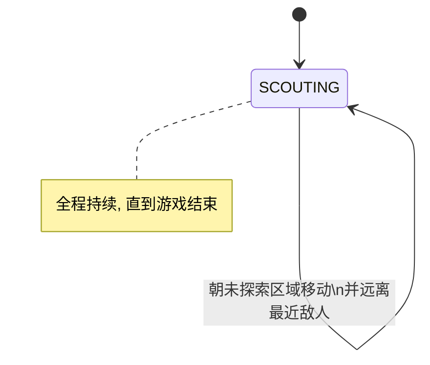
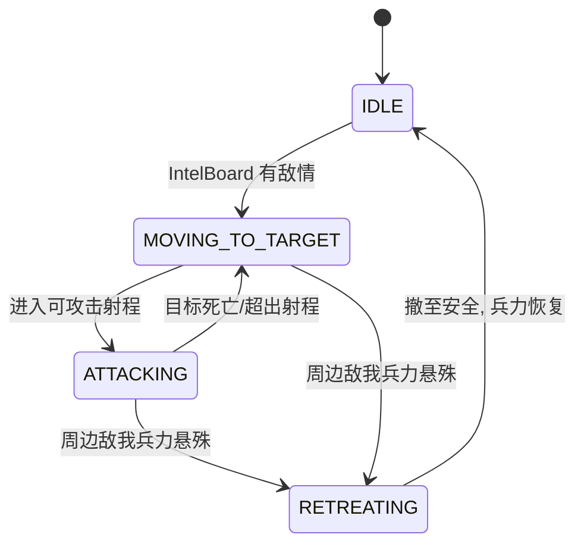
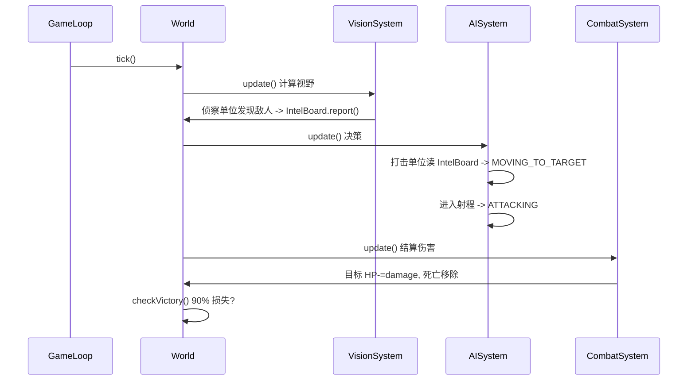

# GDUWS 详细设计说明书

> 项目：**Ghost Domains: Unmanned Warfare Sim（GDUWS）** —— 2D 无人装备战争模拟游戏
>
> 本文档依据 [需求分析说明书.md](需求分析说明书.md)、[概要设计说明书.md](概要设计说明书.md) 与 [RustedWarfare分析文档.md](RustedWarfare分析文档.md) 编写，给出可直接指导编码（对应 `todo.md` 第 3、4 项）的详细设计。

---

## 一、引言

### 1.1 编写目的

本说明书将概要设计中的"游戏流程、地图、兵力、行为逻辑、战斗"四大模块细化到**类、数据结构、算法、数据文件格式与接口**层面，作为后续实现步骤规划与 demo 编码的直接依据。

### 1.2 设计范围

| 范围 | 内容 |
| --- | --- |
| 包含 | 布兵阶段、自动战斗推演、四维移动域、攻击域克制、侦察/打击群体 AI、网格地图、胜负判定、数据驱动配置 |
| 暂不包含 | 资源采集与建造体系、单位升级树、联网对战、Mod 系统、复杂弹道（追踪/范围伤害仅作扩展点预留） |

### 1.3 设计原则

1. **数据驱动**：单位属性、关卡、地图外置为配置文件，引擎只实现通用逻辑（借鉴 RustedWarfare）。
2. **逻辑与渲染分离**：核心模拟（model）不依赖渲染层（view），便于无界面跑规则推演与单元测试。
3. **tick 驱动**：以固定步长的逻辑帧推进战斗，保证可复现的"规则推演"。
4. **MVP 优先**：先实现概要设计要求的最小可行模型，扩展特性留接口。

---

## 二、技术选型

| 项 | 选型 | 说明 |
| --- | --- | --- |
| 语言 | **Java 13**（沿用参考项目随附 `jvm64`） | 与 RustedWarfare 一致，便于复用素材与内置 JRE；语法限经典 `switch`，不用 record/switch 表达式 |
| 渲染 | **Java2D / Swing（`JPanel` + `Graphics2D`）** | demo 阶段轻量，无需 LWJGL；后期可替换为 libGDX |
| 配置格式 | **JSON**（单位/关卡） | 手写极简 JSON 解析器 `data/Json.java`，无第三方依赖 |
| 美术素材 | 复用 `RustedWarfare/assets/units/*.png` | 见分析文档第七节映射表 |
| 构建 | PowerShell 脚本 + `javac` | 无 Maven；`compile/build/run.ps1`，`build.ps1` 产出 jar + 原生 exe + 内置 JRE |

> 渲染与模拟解耦，因此即便后续更换渲染框架（libGDX/Slick2D），`model` 层代码无需改动。

---

## 三、系统总体结构

### 3.1 分层架构



### 3.2 模块职责

| 模块 | 主要类 | 职责 |
| --- | --- | --- |
| 主循环/状态 | `GameLoop`、`GameStateManager` | 驱动逻辑帧、管理选关→布兵→战斗→结算状态切换 |
| 世界 | `World` | 持有地图与全部单位，每 tick 推进模拟 |
| 地图 | `GameMap`、`Tile` | 网格、地形、可通行性、坐标换算 |
| 单位 | `Unit`、`UnitDef`、枚举 | 单位运行时状态 + 静态属性 |
| 战斗 | `CombatSystem`、`Projectile` | 目标选择、命中结算、扣血、死亡处理 |
| AI | `AISystem`、`UnitAI`（FSM） | 侦察/打击行为状态机、协同情报 |
| 寻路 | `Pathfinder` | A* 网格寻路、避战代价 |
| 视野 | `VisionSystem`、`IntelBoard` | 视野计算、敌情共享 |
| 数据 | `UnitDefLoader`、`LevelLoader` | 解析 JSON 配置 |
| 表现 | `GameRenderer`、`InputHandler`、各 `Screen` | 渲染、交互、界面 |

---

## 四、数据结构与类设计

### 4.1 核心枚举

```java
// 移动域：决定可通行地形与所处高度层
public enum MovementType { LAND, WATER, AIR, UNDERWATER }

// 单位角色：决定 AI 行为状态机
public enum UnitRole { SCOUT, STRIKE }

// 阵营
public enum Faction { PLAYER, ENEMY }

// 地形类型
public enum TerrainType { PLAIN, MOUNTAIN, WATER }   // PLAIN 可走陆地, MOUNTAIN 不可走, WATER 水域

// 单位 AI 状态
public enum UnitState { IDLE, SCOUTING, MOVING_TO_TARGET, ATTACKING, RETREATING, DEAD }
```

### 4.2 攻击域（攻击克制规则）

借鉴 RustedWarfare 的"三开关"，扩展为四个布尔位，精确表达概要设计的克制关系。

```java
public class AttackProfile {
    public boolean canAttackLand;        // 打地面
    public boolean canAttackWaterSurface;// 打水面(战列舰/驱逐舰)
    public boolean canAttackAir;         // 打空中
    public boolean canAttackUnderwater;  // 打水下(潜艇)
    public int     maxAttackRange;       // 最大射程(像素或格)
    public int     directDamage;         // 直接伤害
    public int     shootDelay;           // 射击冷却(tick)

    /** 判断本单位能否攻击目标单位 */
    public boolean canTarget(Unit target) {
        switch (target.layer()) {        // layer 由 movementType + 是否水下推导
            case LAND:        return canAttackLand;
            case WATER:       return canAttackWaterSurface;
            case AIR:         return canAttackAir;
            case UNDERWATER:  return canAttackUnderwater;
        }
        return false;
    }
}
```

各单位攻击域配置对照（落实概要设计第三节）：

| 单位 | 移动域 | 打地 | 打水面 | 打空 | 打水下 |
| --- | --- | :---: | :---: | :---: | :---: |
| 轻型坑克 | LAND | ✓ | ✓ | ✗ | ✗ |
| 重型坑克 | LAND | ✓ | ✓ | ✓ | ✗ |
| 战列舰 | WATER | ✗ | ✓ | ✗ | ✗ |
| 驱逐舰 | WATER | ✗ | ✓ | ✓ | ✓ |
| 潜艇 | UNDERWATER | ✗ | ✓ | ✗ | ✓ |
| 拦截机 | AIR | ✗ | ✗ | ✓ | ✗ |
| 攻击机 | AIR | ✓ | ✓ | ✗ | ✗ |

> 表中不列“角色”列：**角色不随单位类型固定**，任意单位都可在关卡或布兵时被指定为 `STRIKE` 或 `SCOUT`（见 4.4 / 6.2）。作为 `SCOUT` 时主打侦察与避战，不主动交火。

> **"只有驱逐舰和潜艇能打潜艇"** 由 `canAttackUnderwater` 唯一控制：仅驱逐舰与潜艇置 true，其余皆 false，规则天然成立。

### 4.3 单位静态定义 `UnitDef`

由 JSON 加载，全程只读、可被多个实例共享（享元）。

```java
public class UnitDef {
    public String       id;            // 唯一标识, 如 "light_tank"
    public String       displayName;   // 显示名
    public int          maxHp;
    public double       radius;        // 碰撞/选择半径
    public MovementType movementType;
    public double       moveSpeed;     // 每 tick 位移
    public int          sightRange;    // 视野半径(侦察核心)
    public AttackProfile attack;
    public String       spritePath;    // 复用 RustedWarfare 的 png
}
```

> **角色（`UnitRole`）不属于 `UnitDef`**：同一种单位既可作打击亦可作侦察，角色由关卡或布兵阶段按实例指定，记录在运行时 `Unit.role` 上。因此无需单独的 `scout` 单位类型，任意单位都能被赋予 `SCOUT` 角色。

### 4.4 单位运行时 `Unit`

```java
public class Unit {
    // 静态
    public final UnitDef def;
    public final Faction faction;
    public UnitRole role;            // 运行时角色(由关卡/布兵指定)
    // 动态
    public double x, y;          // 战场坐标(像素)
    public double facing;        // 朝向(弧度)
    public int    hp;
    public UnitState state = UnitState.IDLE;
    public int    shootCooldown = 0;
    public Unit   currentTarget;     // 当前攻击目标
    public Deque<Point> path;        // 当前路径
    public Point  moveGoal;          // 移动终点(格)

    public boolean isDead()  { return hp <= 0; }
    public boolean isScout() { return role == UnitRole.SCOUT; }
    public UnitLayer layer() { /* 由 movementType 推导 LAND/WATER/AIR/UNDERWATER */ }
}
```

### 4.5 地图 `GameMap` 与 `Tile`

```java
public class Tile {
    public TerrainType terrain;  // PLAIN / MOUNTAIN / WATER
}

public class GameMap {
    public final int cols, rows;
    public final int tileSize;          // 像素/格, 取 20 与参考项目一致
    private final Tile[][] tiles;

    /** 指定移动域能否通行该格 */
    public boolean isPassable(int cx, int cy, MovementType mt) {
        TerrainType t = tiles[cy][cx].terrain;
        switch (mt) {
            case AIR:        return true;                 // 空中无视地形
            case LAND:       return t == TerrainType.PLAIN;
            case WATER:
            case UNDERWATER: return t == TerrainType.WATER;
        }
        return false;
    }
    // 像素<->格 坐标换算
    public int toCol(double px) { return (int)(px / tileSize); }
    public int toRow(double py) { return (int)(py / tileSize); }
}
```

> **空域不占格子**：`AIR` 单位 `isPassable` 恒为 true，且不参与地面/水面碰撞，落实概要设计"空域是特殊区域、不占格子"的设定。

### 4.6 类关系总览



---

## 五、模块详细设计

### 5.1 游戏状态机（总流程）

落实概要设计第一节总流程：选关 → 布兵 → 自动战斗 → 结算。



| 状态 | 行为 |
| --- | --- |
| `LEVEL_SELECT` | 列出关卡，加载 `LevelDef` |
| `DEPLOY` | 加载敌方预置单位；玩家在可通行格放置己方单位；校验放置合法性 |
| `BATTLE` | 关闭交互，`World.tick()` 自动推演 |
| `RESULT` | 显示胜负，提供"下一关/重试" |

### 5.2 主循环 `GameLoop`

固定步长（如 30 tick/s）逻辑更新，渲染可独立帧率。

```java
public void run() {
    final long stepNs = 1_000_000_000L / 30;   // 逻辑帧
    long acc = 0, last = System.nanoTime();
    while (running) {
        long now = System.nanoTime();
        acc += now - last; last = now;
        while (acc >= stepNs) {
            if (state == BATTLE) world.tick();  // 仅战斗态推进模拟
            acc -= stepNs;
        }
        renderer.render(world);                  // 渲染
    }
}
```

### 5.3 `World.tick()` —— 单帧模拟流水线


```java
public void tick() {
    visionSystem.update(this);   // 谁能看见谁
    aiSystem.update(this);       // 决策: 设定 state / moveGoal / target
    movementSystem.update(this); // 沿路径移动
    combatSystem.update(this);   // 攻击结算
    removeDead();
    checkVictory();              // 触发 BATTLE -> RESULT
}
```

### 5.4 视野与情报系统 `VisionSystem` / `IntelBoard`

落实"侦察→共享情报→打击"协同链。

- 每 tick 计算每个单位 `sightRange` 内的敌方单位。
- 发现的敌人写入本阵营 `IntelBoard`（已知敌情列表，含位置与时间戳）。
- 打击单位**不直接依赖自身视野**，而是查询本阵营 `IntelBoard` 获取目标 —— 实现"侦察单位发现后打击单位才行动"。

```java
public class IntelBoard {
    // 本阵营已知的敌方单位 -> 最近一次被发现的位置/时间
    private Map<Unit, IntelEntry> known = new HashMap<>();
    public void report(Unit enemy, double x, double y, int tick) { ... }
    public Collection<IntelEntry> knownEnemies() { ... }
    public boolean hasAnyEnemy() { return !known.isEmpty(); }
}
```

### 5.5 群体 AI `AISystem`（核心创新）

每个单位由角色对应的有限状态机驱动。这是 GDUWS 相对 RustedWarfare 的差异化重点。

#### 5.5.1 侦察单位 FSM



行为规则（落实概要设计四-2-侦察）：
1. 战斗开始即进入 `SCOUTING`，直到游戏结束。
2. 选择探索目标：未探索/久未探索的区域（地图按区块记录"最后探索时间"，选最旧区块）。
3. **避战**：寻路代价叠加"敌人威胁场"——靠近已知敌人的格子代价升高，路径自然绕开敌人。
4. 发现敌人即上报 `IntelBoard`。

```java
void updateScout(Unit u, World w) {
    visionReport(u, w);                       // 上报视野内敌人
    if (u.path == null || reachedGoal(u)) {
        Point region = w.map.oldestUnexploredRegion(u.faction);
        u.moveGoal = region;
        u.path = pathfinder.findPath(u, region, /*avoidEnemies=*/true);
    }
    u.state = UnitState.SCOUTING;
}
```

#### 5.5.2 打击单位 FSM



行为规则（落实概要设计四-2-打击）：
1. 开局 `IDLE` 静止，等待 `IntelBoard.hasAnyEnemy()`。
2. 有敌情后 `MOVING_TO_TARGET`：选择**最近的、本单位攻击域可命中**的已知敌人前往。
3. 进入射程转 `ATTACKING`，交由 `CombatSystem` 结算。
4. **撤退判定**：以本单位为圆心半径 `R` 内，比较友/敌兵力；若 `friendlyPower < enemyPower * RETREAT_RATIO`（如 0.5），转 `RETREATING`，向远离敌人质心方向撤至安全点。

```java
void updateStrike(Unit u, World w) {
    if (shouldRetreat(u, w)) { startRetreat(u, w); return; }
    if (!w.intel(u.faction).hasAnyEnemy()) { u.state = IDLE; u.path = null; return; }

    Unit tgt = selectNearestAttackable(u, w);   // 攻击域过滤 + 最近
    if (tgt == null) { u.state = IDLE; return; }
    u.currentTarget = tgt;

    if (inRange(u, tgt)) {
        u.state = ATTACKING;                      // CombatSystem 接管开火
    } else {
        u.state = MOVING_TO_TARGET;
        u.path = pathfinder.findPath(u, w.map.toCell(tgt.x, tgt.y), false);
    }
}
```

撤退兵力评估：

```java
boolean shouldRetreat(Unit u, World w) {
    double friendly = 0, enemy = 0;
    for (Unit o : w.unitsWithin(u.x, u.y, THREAT_RADIUS)) {
        double power = o.hp;                       // 简化: 以剩余HP为战力权重
        if (o.faction == u.faction) friendly += power; else enemy += power;
    }
    return enemy > 0 && friendly < enemy * RETREAT_RATIO;
}
```

### 5.6 寻路 `Pathfinder`（A*）

- 基于 `GameMap` 网格，按单位 `movementType` 取可通行格。
- 4/8 邻接，启发式用对角距离（Octile）。
- **避战权重**（侦察用）：格子额外代价 `threatCost(cell) = Σ over knownEnemies max(0, K - dist)`，使路径远离敌人。

```java
public Deque<Point> findPath(Unit u, Point goal, boolean avoidEnemies) {
    // 标准 A*：g + h，avoidEnemies 时 g 叠加 threatCost
    // movementType 决定 isPassable
}
```

> 性能：地图规模（如 130×130）配合开放表二叉堆，单次寻路开销可控；可加路径缓存与"每 N tick 重算"降低频率。

### 5.7 战斗系统 `CombatSystem`

落实概要设计第五节与分析文档 3.1 战斗循环（简化为命中瞬时结算）。

```java
public void update(World w) {
    for (Unit u : w.units) {
        if (u.isDead() || !u.def.attack.canAttackAnything()) continue;
        if (u.shootCooldown > 0) { u.shootCooldown--; continue; }
        Unit tgt = u.currentTarget;
        if (tgt == null || tgt.isDead()) continue;
        if (!u.def.attack.canTarget(tgt)) continue;          // 攻击域
        if (dist(u, tgt) > u.def.attack.maxAttackRange) continue; // 射程
        // 命中结算(MVP: 直接命中)
        tgt.hp -= u.def.attack.directDamage;
        u.facing = angleTo(tgt);
        u.shootCooldown = u.def.attack.shootDelay;           // 冷却
    }
}
```

**扩展点**（预留接口，不在 MVP 实现）：`Projectile` 弹道飞行、`areaDamage` 范围伤害、追踪弹。

### 5.8 胜负判定

```java
void checkVictory() {
    for (Faction f : Faction.values()) {
        int alive = countAlive(f), init = initialCount(f);
        if (alive <= init * 0.10) {        // 损失≥90%
            endBattle(loser = f);
            state = RESULT;
        }
    }
}
```

### 5.9 布兵阶段 `DeployController`

- 加载关卡：敌方单位按 `LevelDef` 预置；玩家获得可用单位清单与数量。
- 玩家点击单位类型 → 在地图点击放置；校验：
  - 目标格对该单位 `movementType` 可通行；
  - 不与已有单位重叠；
  - 数量不超上限。
- 点击"开始"→ 切换 `BATTLE`。

---

## 六、数据文件格式

### 6.1 单位配置 `data/units/*.json`

```json
{
  "id": "light_tank",
  "displayName": "轻型坦克",
  "maxHp": 210,
  "radius": 11,
  "movementType": "LAND",
  "moveSpeed": 1.1,
  "sightRange": 120,
  "role": "STRIKE",
  "spritePath": "assets/units/tanks/tank.png",
  "attack": {
    "canAttackLand": true,
    "canAttackWaterSurface": true,
    "canAttackAir": false,
    "canAttackUnderwater": false,
    "maxAttackRange": 130,
    "directDamage": 25,
    "shootDelay": 75
  }
}
```

`destroyer.json`（驱逐舰，体现克制差异）：

```json
{
  "id": "destroyer", "displayName": "驱逐舰",
  "maxHp": 320, "movementType": "WATER", "moveSpeed": 0.9,
  "sightRange": 130, "role": "STRIKE",
  "spritePath": "assets/units/heavy_aa_ship/heavy_aa_ship.png",
  "attack": {
    "canAttackLand": false, "canAttackWaterSurface": true,
    "canAttackAir": true, "canAttackUnderwater": true,
    "maxAttackRange": 140, "directDamage": 18, "shootDelay": 40
  }
}
```

### 6.2 关卡配置 `data/levels/*.json`

```json
{
  "id": "level_01",
  "name": "海陆遭遇战",
  "map": "data/maps/level_01.map",
  "playerBudget": { "light_tank": 4, "interceptor": 2, "destroyer": 2 },
  "enemyUnits": [
    { "unitId": "heavy_tank", "col": 6,  "row": 18, "role": "STRIKE" },
    { "unitId": "light_tank", "col": 8,  "row": 17, "role": "SCOUT"  },
    { "unitId": "submarine",  "col": 22, "row": 10, "role": "STRIKE" }
  ]
}
```

> `playerBudget` 给出玩家可用各类单位上限；`enemyUnits` 逐个预置敌方单位并为其指定 `role`（打击/侦察）。

### 6.3 地图数据 `data/maps/*.map`

MVP 采用简单字符网格（`.`=平地, `#`=山地, `~`=水域），便于手写与解析；后期可平滑迁移到 Tiled TMX（见分析文档 4.1）。

```
# 第一行: cols rows tileSize
20 12 20
....~~~~....########
....~~~~............
..######........~~~~
...
```

---

## 七、界面设计

| 界面 | 主要元素 |
| --- | --- |
| 选关 `LevelSelectScreen` | 关卡列表、缩略图、开始按钮 |
| 布兵 `DeployScreen` | 地图视图、可用单位面板（图标+剩余数量）、放置/移除、"开始战斗"按钮 |
| 战斗 `BattleScreen` | 实时渲染单位/地形、血条、视野提示、双方剩余兵力计数（只读，无操控） |
| 结算 `ResultScreen` | 胜/负、统计、"下一关 / 重新挑战 / 退出" |

渲染要点：地形按 `TerrainType` 着色或贴图块；单位用复用的 PNG，按 `facing` 旋转；空中单位绘制阴影并叠加在地表之上；选中/受击给视觉反馈。

---

## 八、关键时序

### 8.1 一次战斗推演（侦察→打击协同）



---

## 九、与概要设计的可追溯性

| 概要设计条目 | 详细设计落地 |
| --- | --- |
| 总流程(选关/布兵/自动战斗/结算) | 5.1 状态机、5.2 主循环、5.9 布兵 |
| 陆地(平地/山地)、水域、空域不占格 | 4.5 `GameMap.isPassable`、`TerrainType` |
| 七种单位 + 攻击克制 | 4.2 `AttackProfile`、4.2 对照表、6.1 配置 |
| "只有驱逐舰/潜艇能打潜艇" | 4.2 `canAttackUnderwater` 唯一控制 |
| 侦察(持续探索/避战/发现敌人) | 5.5.1 侦察 FSM、5.4 情报、5.6 避战寻路 |
| 打击(待命/进攻最近/兵力悬殊撤退) | 5.5.2 打击 FSM、撤退评估、目标选择 |
| 自动战斗 + 90% 损失结束 | 5.3 流水线、5.7 战斗、5.8 胜负判定 |

---

## 十、实现步骤建议（对接 todo 第 3 项）

1. **骨架**：`World`/`GameMap`/`Unit`/`UnitDef` 数据结构 + JSON 加载。
2. **渲染与布兵**：Swing 画地图与单位，布兵交互。
3. **移动与寻路**：A* + 沿路径移动 + 碰撞。
4. **视野与情报**：`VisionSystem` + `IntelBoard`。
5. **AI 状态机**：侦察、打击 FSM（含避战、撤退）。
6. **战斗与胜负**：`CombatSystem` + 90% 判定 + 结算界面。
7. **调参与素材**：复用 RustedWarfare PNG，平衡单位数值。

---

## 附：MVP 字段集（最小实现清单）

```
UnitDef: id, displayName, maxHp, radius, movementType, moveSpeed, sightRange, role, spritePath
Attack : canAttackLand, canAttackWaterSurface, canAttackAir, canAttackUnderwater,
         maxAttackRange, directDamage, shootDelay
Unit   : x, y, facing, hp, state, shootCooldown, currentTarget, path, moveGoal
Map    : cols, rows, tileSize, Tile.terrain
```
